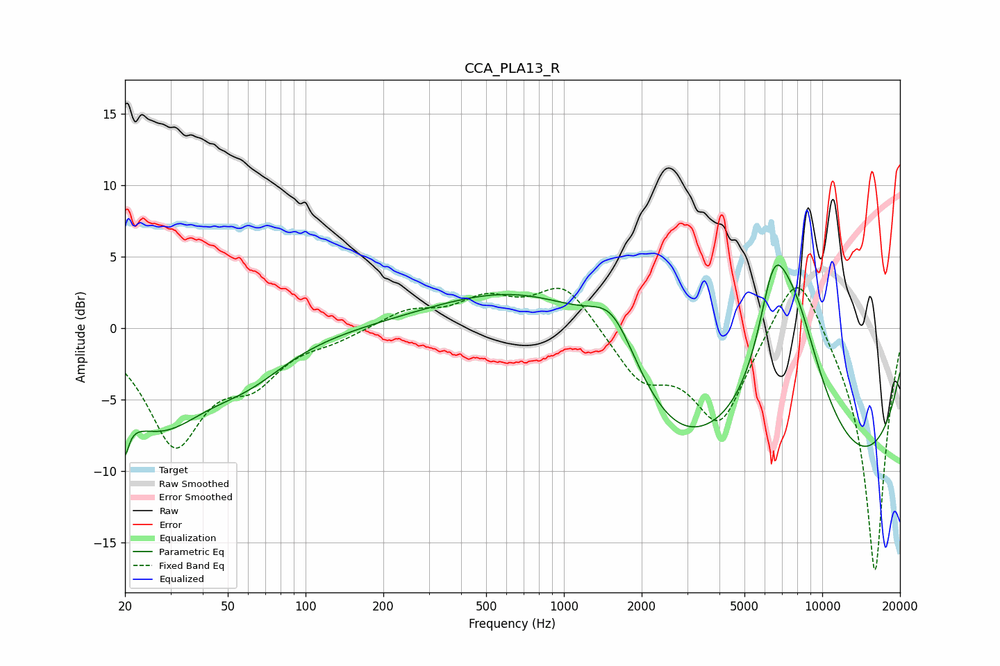

# CCA_PLA13_R
See [usage instructions](https://github.com/jaakkopasanen/AutoEq#usage) for more options and info.

### Parametric EQs
Apply preamp of -4.5 dB when using parametric equalizer.

|   # | Type    |   Fc (Hz) |    Q |   Gain (dB) |
|-----|---------|-----------|------|-------------|
|   1 | Peaking |        20 | 5.82 |        -6.4 |
|   2 | Peaking |        20 | 5.96 |         3.2 |
|   3 | Peaking |        27 | 0.74 |        -6.4 |
|   4 | Peaking |        60 | 0.9  |        -2.1 |
|   5 | Peaking |      1136 | 0.31 |         4.4 |
|   6 | Peaking |      1552 | 1.57 |         3.5 |
|   7 | Peaking |      2565 | 0.73 |        -4.3 |
|   8 | Peaking |      6480 | 2.29 |         6.6 |
|   9 | Peaking |      7812 | 0.93 |        12.5 |
|  10 | Peaking |      8838 | 0.21 |       -13.2 |

### Fixed Band EQs
When using fixed band (also called graphic) equalizer, apply preamp of **-2.9 dB** (if available) and set gains manually with these parameters.

|   # | Type    |   Fc (Hz) |    Q |   Gain (dB) |
|-----|---------|-----------|------|-------------|
|   1 | Peaking |        31 | 1.41 |        -7.8 |
|   2 | Peaking |        62 | 1.41 |        -3   |
|   3 | Peaking |       125 | 1.41 |        -0.6 |
|   4 | Peaking |       250 | 1.41 |         1.2 |
|   5 | Peaking |       500 | 1.41 |         1.9 |
|   6 | Peaking |      1000 | 1.41 |         3.2 |
|   7 | Peaking |      2000 | 1.41 |        -3.3 |
|   8 | Peaking |      4000 | 1.41 |        -6.5 |
|   9 | Peaking |      8000 | 1.41 |         5.2 |
|  10 | Peaking |     16000 | 1.41 |       -17.3 |

### Graphs

