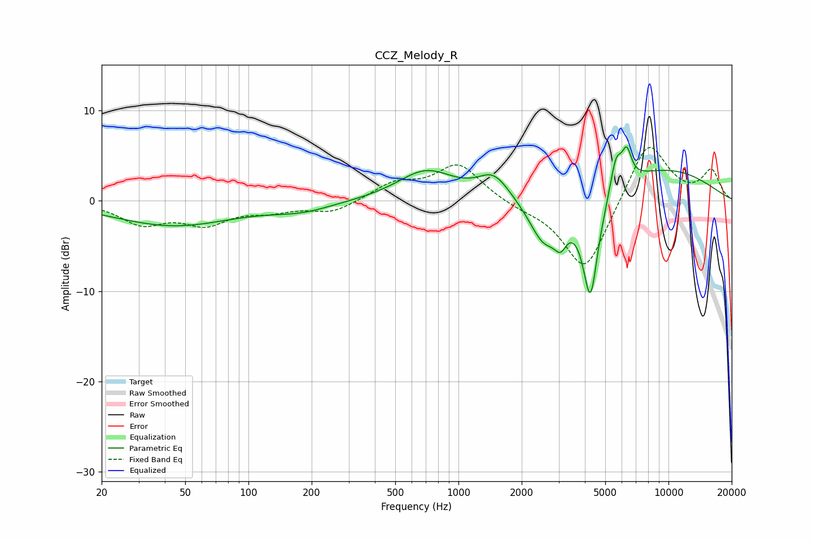

# CCZ_Melody_R
See [usage instructions](https://github.com/jaakkopasanen/AutoEq#usage) for more options and info.

### Parametric EQs
Apply preamp of -6.0 dB when using parametric equalizer.

|   # | Type    |   Fc (Hz) |    Q |   Gain (dB) |
|-----|---------|-----------|------|-------------|
|   1 | Peaking |        44 | 0.5  |        -2.7 |
|   2 | Peaking |       179 | 0.96 |        -0.9 |
|   3 | Peaking |       700 | 1.05 |         3.3 |
|   4 | Peaking |      1473 | 1.89 |         2.6 |
|   5 | Peaking |      2551 | 1.95 |        -4.8 |
|   6 | Peaking |      3066 | 4.61 |        -2.4 |
|   7 | Peaking |      4249 | 3.67 |       -11.5 |
|   8 | Peaking |      5625 | 5.07 |         3.7 |
|   9 | Peaking |      6327 | 6    |         3.2 |
|  10 | Peaking |      9360 | 0.46 |         3.5 |

### Fixed Band EQs
When using fixed band (also called graphic) equalizer, apply preamp of **-6.0 dB** (if available) and set gains manually with these parameters.

|   # | Type    |   Fc (Hz) |    Q |   Gain (dB) |
|-----|---------|-----------|------|-------------|
|   1 | Peaking |        31 | 1.41 |        -2.4 |
|   2 | Peaking |        62 | 1.41 |        -2.3 |
|   3 | Peaking |       125 | 1.41 |        -0.9 |
|   4 | Peaking |       250 | 1.41 |        -1.3 |
|   5 | Peaking |       500 | 1.41 |         1.8 |
|   6 | Peaking |      1000 | 1.41 |         4   |
|   7 | Peaking |      2000 | 1.41 |        -0.6 |
|   8 | Peaking |      4000 | 1.41 |        -8.1 |
|   9 | Peaking |      8000 | 1.41 |         6.9 |
|  10 | Peaking |     16000 | 1.41 |         3.2 |

### Graphs

