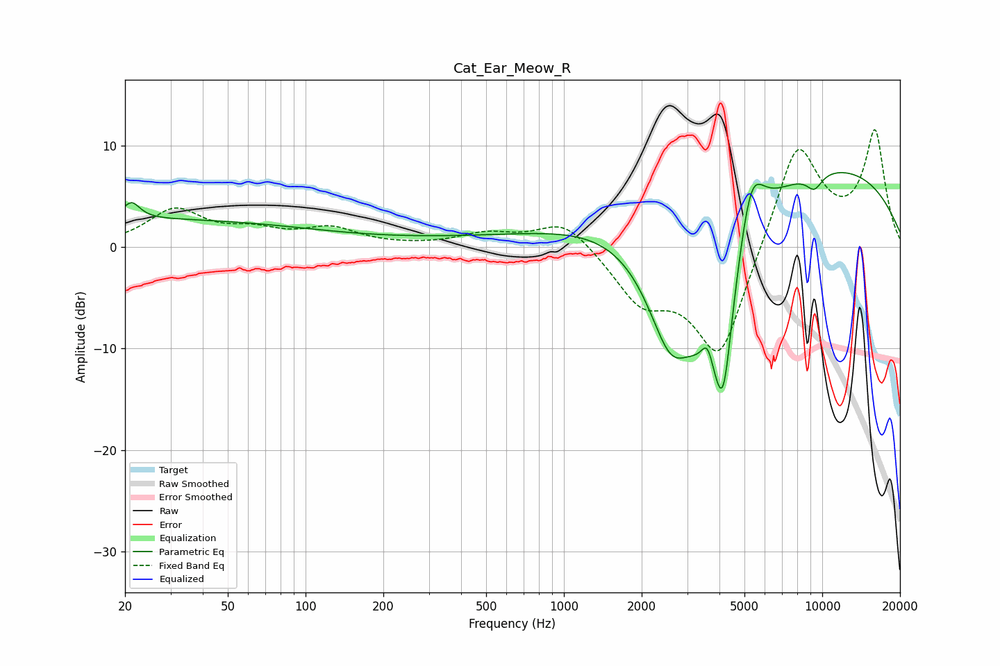

# Cat_Ear_Meow_R
See [usage instructions](https://github.com/jaakkopasanen/AutoEq#usage) for more options and info.

### Parametric EQs
Apply preamp of -7.5 dB when using parametric equalizer.

|   # | Type    |   Fc (Hz) |    Q |   Gain (dB) |
|-----|---------|-----------|------|-------------|
|   1 | Peaking |        21 | 4.48 |         1.6 |
|   2 | Peaking |        22 | 0.18 |         2.7 |
|   3 | Peaking |      1118 | 0.19 |         0.9 |
|   4 | Peaking |      2583 | 1.42 |       -10.3 |
|   5 | Peaking |      3599 | 5.69 |         3.2 |
|   6 | Peaking |      3783 | 1.2  |       -14.9 |
|   7 | Peaking |      4145 | 4.24 |        -8.5 |
|   8 | Peaking |      5301 | 2.65 |         7.2 |
|   9 | Peaking |      7544 | 0.21 |         9.2 |
|  10 | Peaking |      9319 | 4.04 |        -1.5 |

### Fixed Band EQs
When using fixed band (also called graphic) equalizer, apply preamp of **-11.7 dB** (if available) and set gains manually with these parameters.

|   # | Type    |   Fc (Hz) |    Q |   Gain (dB) |
|-----|---------|-----------|------|-------------|
|   1 | Peaking |        31 | 1.41 |         3.6 |
|   2 | Peaking |        62 | 1.41 |         1.3 |
|   3 | Peaking |       125 | 1.41 |         1.7 |
|   4 | Peaking |       250 | 1.41 |         0   |
|   5 | Peaking |       500 | 1.41 |         1.2 |
|   6 | Peaking |      1000 | 1.41 |         2.9 |
|   7 | Peaking |      2000 | 1.41 |        -4.7 |
|   8 | Peaking |      4000 | 1.41 |       -11.3 |
|   9 | Peaking |      8000 | 1.41 |        10.9 |
|  10 | Peaking |     16000 | 1.41 |        11.1 |

### Graphs

