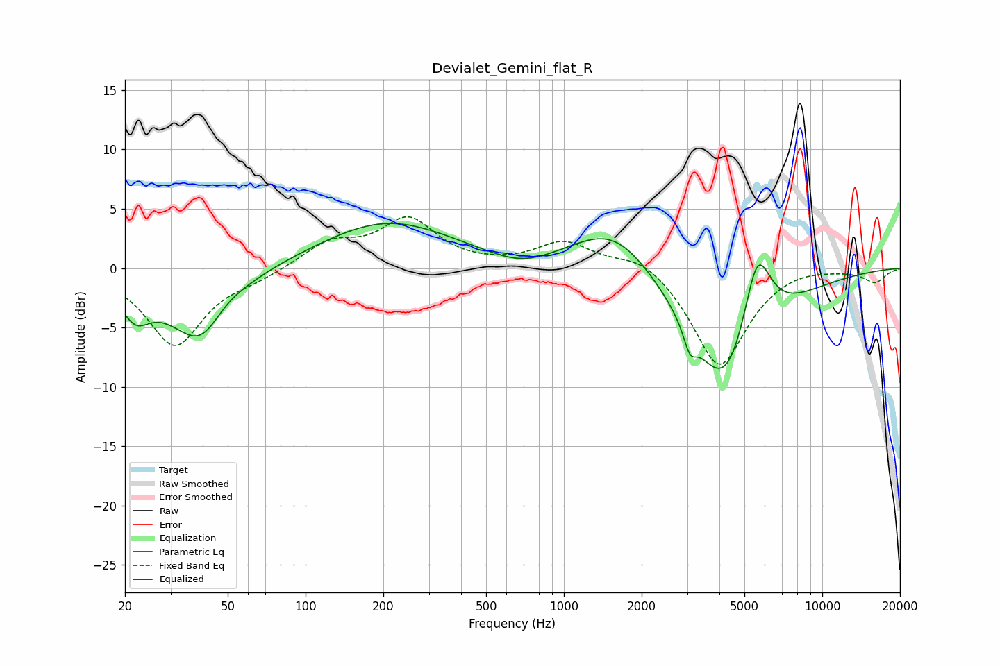

# Devialet_Gemini_flat_R
See [usage instructions](https://github.com/jaakkopasanen/AutoEq#usage) for more options and info.

### Parametric EQs
Apply preamp of -3.9 dB when using parametric equalizer.

|   # | Type    |   Fc (Hz) |    Q |   Gain (dB) |
|-----|---------|-----------|------|-------------|
|   1 | Peaking |        22 | 2.66 |        -2.5 |
|   2 | Peaking |        32 | 0.71 |        -1.7 |
|   3 | Peaking |        40 | 1.39 |        -4.9 |
|   4 | Peaking |        48 | 2    |         1   |
|   5 | Peaking |       207 | 0.54 |         3.9 |
|   6 | Peaking |       685 | 1.16 |        -1.1 |
|   7 | Peaking |      1571 | 0.86 |         4.3 |
|   8 | Peaking |      3072 | 5.99 |        -1.8 |
|   9 | Peaking |      4254 | 0.93 |       -11.5 |
|  10 | Peaking |      5589 | 2.39 |         8.1 |

### Fixed Band EQs
When using fixed band (also called graphic) equalizer, apply preamp of **-4.4 dB** (if available) and set gains manually with these parameters.

|   # | Type    |   Fc (Hz) |    Q |   Gain (dB) |
|-----|---------|-----------|------|-------------|
|   1 | Peaking |        31 | 1.41 |        -6.5 |
|   2 | Peaking |        62 | 1.41 |        -0.7 |
|   3 | Peaking |       125 | 1.41 |         2   |
|   4 | Peaking |       250 | 1.41 |         4   |
|   5 | Peaking |       500 | 1.41 |         0.1 |
|   6 | Peaking |      1000 | 1.41 |         2.2 |
|   7 | Peaking |      2000 | 1.41 |         1.3 |
|   8 | Peaking |      4000 | 1.41 |        -8.4 |
|   9 | Peaking |      8000 | 1.41 |         0.3 |
|  10 | Peaking |     16000 | 1.41 |        -1.2 |

### Graphs

