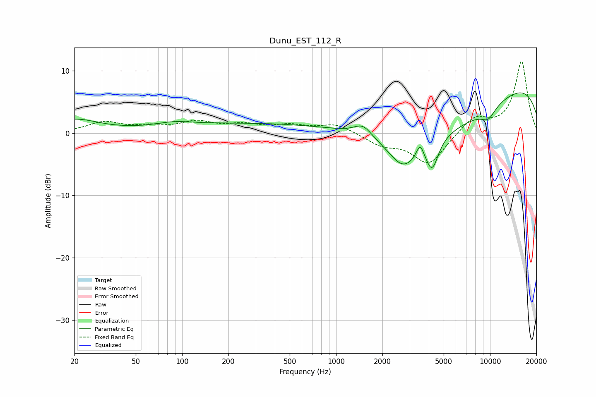

# Dunu_EST_112_R
See [usage instructions](https://github.com/jaakkopasanen/AutoEq#usage) for more options and info.

### Parametric EQs
Apply preamp of -6.5 dB when using parametric equalizer.

|   # | Type    |   Fc (Hz) |    Q |   Gain (dB) |
|-----|---------|-----------|------|-------------|
|   1 | Peaking |        20 | 0.91 |         2.1 |
|   2 | Peaking |        89 | 1.24 |         0.7 |
|   3 | Peaking |       360 | 0.2  |         1.6 |
|   4 | Peaking |      1491 | 2.51 |         1.8 |
|   5 | Peaking |      2745 | 1.41 |        -5.1 |
|   6 | Peaking |      3513 | 5.8  |         2.3 |
|   7 | Peaking |      4205 | 3.47 |        -4.7 |
|   8 | Peaking |      4867 | 0.3  |        -9   |
|   9 | Peaking |      9192 | 0.18 |        11   |
|  10 | Peaking |      9748 | 2.59 |        -1.8 |

### Fixed Band EQs
When using fixed band (also called graphic) equalizer, apply preamp of **-11.6 dB** (if available) and set gains manually with these parameters.

|   # | Type    |   Fc (Hz) |    Q |   Gain (dB) |
|-----|---------|-----------|------|-------------|
|   1 | Peaking |        31 | 1.41 |         1.6 |
|   2 | Peaking |        62 | 1.41 |         0.8 |
|   3 | Peaking |       125 | 1.41 |         1.6 |
|   4 | Peaking |       250 | 1.41 |         1.1 |
|   5 | Peaking |       500 | 1.41 |         1.1 |
|   6 | Peaking |      1000 | 1.41 |         1.4 |
|   7 | Peaking |      2000 | 1.41 |        -1.7 |
|   8 | Peaking |      4000 | 1.41 |        -5   |
|   9 | Peaking |      8000 | 1.41 |         2.6 |
|  10 | Peaking |     16000 | 1.41 |        11.5 |

### Graphs

