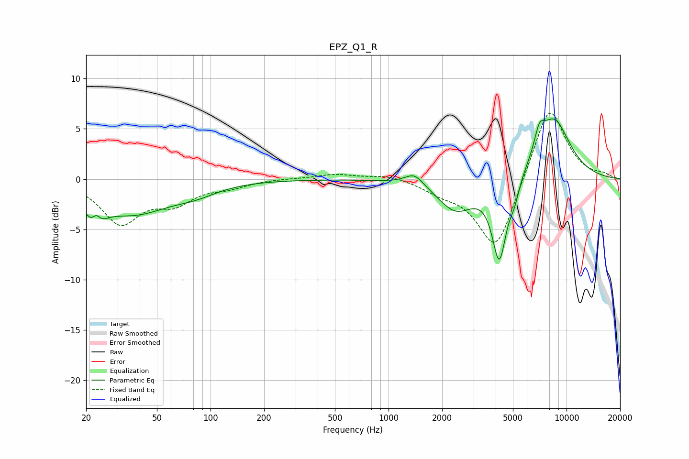

# EPZ_Q1_R
See [usage instructions](https://github.com/jaakkopasanen/AutoEq#usage) for more options and info.

### Parametric EQs
Apply preamp of -6.1 dB when using parametric equalizer.

|   # | Type    |   Fc (Hz) |    Q |   Gain (dB) |
|-----|---------|-----------|------|-------------|
|   1 | Peaking |        22 | 3.13 |        -3.7 |
|   2 | Peaking |        23 | 5.29 |         2.3 |
|   3 | Peaking |        37 | 0.69 |        -3.2 |
|   4 | Peaking |        83 | 1.14 |        -0.8 |
|   5 | Peaking |      1399 | 2.7  |         1.2 |
|   6 | Peaking |      2389 | 1.37 |        -3.1 |
|   7 | Peaking |      4193 | 3.44 |        -7.9 |
|   8 | Peaking |      5099 | 5.2  |        -1.5 |
|   9 | Peaking |      7041 | 4.65 |         2.1 |
|  10 | Peaking |      8480 | 1.36 |         6   |

### Fixed Band EQs
When using fixed band (also called graphic) equalizer, apply preamp of **-6.7 dB** (if available) and set gains manually with these parameters.

|   # | Type    |   Fc (Hz) |    Q |   Gain (dB) |
|-----|---------|-----------|------|-------------|
|   1 | Peaking |        31 | 1.41 |        -4.2 |
|   2 | Peaking |        62 | 1.41 |        -2   |
|   3 | Peaking |       125 | 1.41 |        -0.7 |
|   4 | Peaking |       250 | 1.41 |         0.1 |
|   5 | Peaking |       500 | 1.41 |         0.5 |
|   6 | Peaking |      1000 | 1.41 |         0.5 |
|   7 | Peaking |      2000 | 1.41 |        -1   |
|   8 | Peaking |      4000 | 1.41 |        -7.3 |
|   9 | Peaking |      8000 | 1.41 |         7.7 |
|  10 | Peaking |     16000 | 1.41 |         0.4 |

### Graphs

