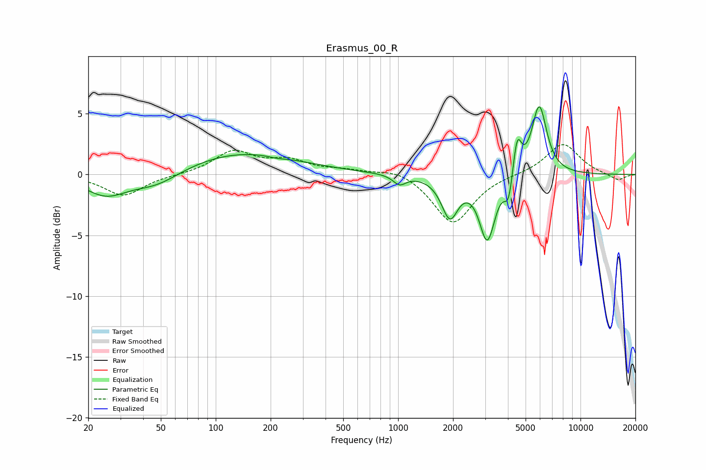

# Erasmus_00_R
See [usage instructions](https://github.com/jaakkopasanen/AutoEq#usage) for more options and info.

### Parametric EQs
Apply preamp of -5.7 dB when using parametric equalizer.

|   # | Type    |   Fc (Hz) |    Q |   Gain (dB) |
|-----|---------|-----------|------|-------------|
|   1 | Peaking |        25 | 1.23 |        -1.7 |
|   2 | Peaking |        47 | 1.05 |        -1.2 |
|   3 | Peaking |       137 | 0.45 |         1.8 |
|   4 | Peaking |       217 | 2.93 |        -0.1 |
|   5 | Peaking |      1018 | 4.07 |        -0.8 |
|   6 | Peaking |      1921 | 3.14 |        -3.3 |
|   7 | Peaking |      3082 | 3.28 |        -5.3 |
|   8 | Peaking |      4041 | 6    |        -2.3 |
|   9 | Peaking |      4491 | 5.96 |         3.2 |
|  10 | Peaking |      5940 | 3.36 |         5.7 |

### Fixed Band EQs
When using fixed band (also called graphic) equalizer, apply preamp of **-2.6 dB** (if available) and set gains manually with these parameters.

|   # | Type    |   Fc (Hz) |    Q |   Gain (dB) |
|-----|---------|-----------|------|-------------|
|   1 | Peaking |        31 | 1.41 |        -1.7 |
|   2 | Peaking |        62 | 1.41 |        -0   |
|   3 | Peaking |       125 | 1.41 |         1.9 |
|   4 | Peaking |       250 | 1.41 |         1   |
|   5 | Peaking |       500 | 1.41 |         0.3 |
|   6 | Peaking |      1000 | 1.41 |         0.6 |
|   7 | Peaking |      2000 | 1.41 |        -4.1 |
|   8 | Peaking |      4000 | 1.41 |         0   |
|   9 | Peaking |      8000 | 1.41 |         2.6 |
|  10 | Peaking |     16000 | 1.41 |        -0.5 |

### Graphs

