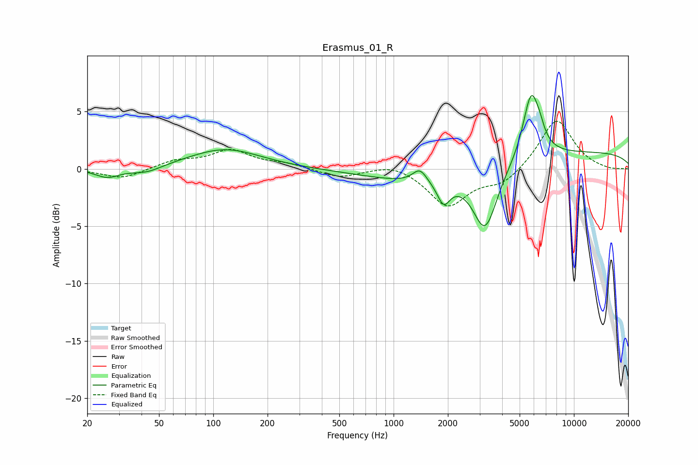

# Erasmus_01_R
See [usage instructions](https://github.com/jaakkopasanen/AutoEq#usage) for more options and info.

### Parametric EQs
Apply preamp of -6.5 dB when using parametric equalizer.

|   # | Type    |   Fc (Hz) |    Q |   Gain (dB) |
|-----|---------|-----------|------|-------------|
|   1 | Peaking |        26 | 2.13 |        -0.8 |
|   2 | Peaking |        43 | 1.66 |        -0.6 |
|   3 | Peaking |       116 | 0.71 |         1.7 |
|   4 | Peaking |      1398 | 3.55 |         1.2 |
|   5 | Peaking |      1634 | 0.44 |        -1.4 |
|   6 | Peaking |      1895 | 4.08 |        -1.9 |
|   7 | Peaking |      3220 | 2.12 |        -5.4 |
|   8 | Peaking |      5800 | 2.98 |         5.8 |
|   9 | Peaking |      6485 | 5.76 |         0.6 |
|  10 | Peaking |      9806 | 0.18 |         1.5 |

### Fixed Band EQs
When using fixed band (also called graphic) equalizer, apply preamp of **-4.3 dB** (if available) and set gains manually with these parameters.

|   # | Type    |   Fc (Hz) |    Q |   Gain (dB) |
|-----|---------|-----------|------|-------------|
|   1 | Peaking |        31 | 1.41 |        -0.9 |
|   2 | Peaking |        62 | 1.41 |         0.7 |
|   3 | Peaking |       125 | 1.41 |         1.6 |
|   4 | Peaking |       250 | 1.41 |         0.4 |
|   5 | Peaking |       500 | 1.41 |        -0.8 |
|   6 | Peaking |      1000 | 1.41 |         0.6 |
|   7 | Peaking |      2000 | 1.41 |        -3.2 |
|   8 | Peaking |      4000 | 1.41 |        -1.3 |
|   9 | Peaking |      8000 | 1.41 |         4.4 |
|  10 | Peaking |     16000 | 1.41 |        -0.1 |

### Graphs

