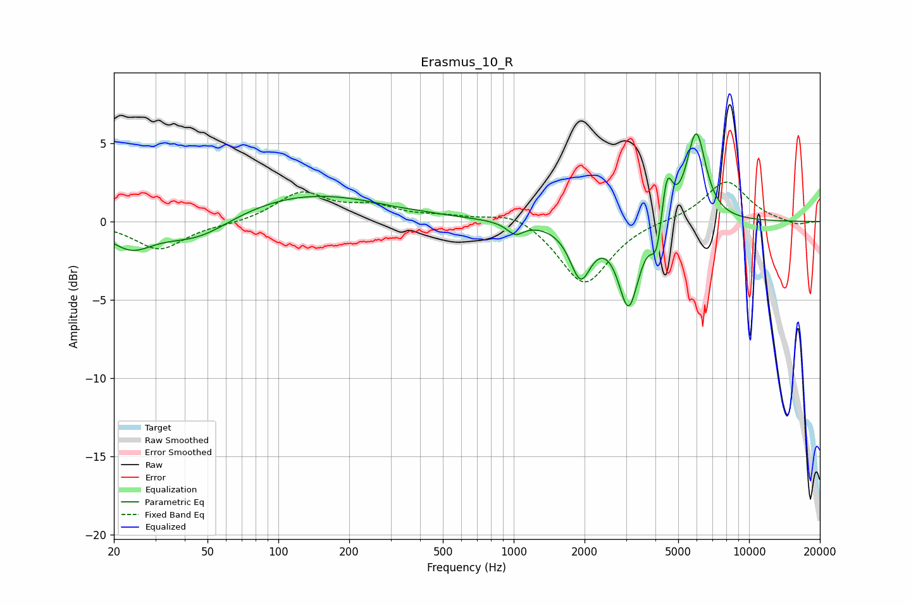

# Erasmus_10_R
See [usage instructions](https://github.com/jaakkopasanen/AutoEq#usage) for more options and info.

### Parametric EQs
Apply preamp of -5.7 dB when using parametric equalizer.

|   # | Type    |   Fc (Hz) |    Q |   Gain (dB) |
|-----|---------|-----------|------|-------------|
|   1 | Peaking |        24 | 1.53 |        -1.6 |
|   2 | Peaking |        45 | 0.95 |        -1.5 |
|   3 | Peaking |       132 | 0.44 |         1.8 |
|   4 | Peaking |       308 | 3.4  |        -0   |
|   5 | Peaking |      1016 | 4.01 |        -0.8 |
|   6 | Peaking |      1923 | 3.17 |        -3.3 |
|   7 | Peaking |      3079 | 3.27 |        -5.3 |
|   8 | Peaking |      4051 | 6    |        -2.2 |
|   9 | Peaking |      4476 | 6    |         3.2 |
|  10 | Peaking |      5960 | 3.35 |         5.7 |

### Fixed Band EQs
When using fixed band (also called graphic) equalizer, apply preamp of **-2.6 dB** (if available) and set gains manually with these parameters.

|   # | Type    |   Fc (Hz) |    Q |   Gain (dB) |
|-----|---------|-----------|------|-------------|
|   1 | Peaking |        31 | 1.41 |        -1.8 |
|   2 | Peaking |        62 | 1.41 |        -0.1 |
|   3 | Peaking |       125 | 1.41 |         1.8 |
|   4 | Peaking |       250 | 1.41 |         0.8 |
|   5 | Peaking |       500 | 1.41 |         0.3 |
|   6 | Peaking |      1000 | 1.41 |         0.7 |
|   7 | Peaking |      2000 | 1.41 |        -4.1 |
|   8 | Peaking |      4000 | 1.41 |         0.1 |
|   9 | Peaking |      8000 | 1.41 |         2.6 |
|  10 | Peaking |     16000 | 1.41 |        -0.3 |

### Graphs

