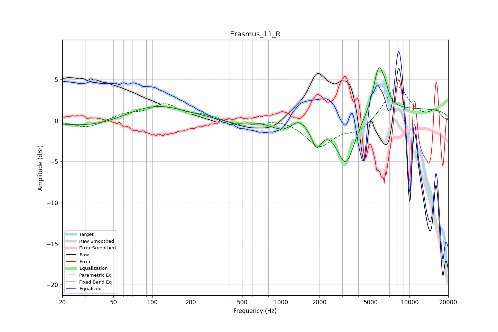

# Erasmus_11_R
See [usage instructions](https://github.com/jaakkopasanen/AutoEq#usage) for more options and info.

### Parametric EQs
Apply preamp of -6.5 dB when using parametric equalizer.

|   # | Type    |   Fc (Hz) |    Q |   Gain (dB) |
|-----|---------|-----------|------|-------------|
|   1 | Peaking |        36 | 0.57 |        -0.9 |
|   2 | Peaking |       105 | 0.61 |         2   |
|   3 | Peaking |       431 | 1.69 |        -0.5 |
|   4 | Peaking |      1032 | 1.6  |        -1.2 |
|   5 | Peaking |      1377 | 2.83 |         0.8 |
|   6 | Peaking |      1897 | 3.44 |        -2.8 |
|   7 | Peaking |      3202 | 1.96 |        -6.1 |
|   8 | Peaking |      5768 | 3.28 |         5.6 |
|   9 | Peaking |      6495 | 5.86 |         1.1 |
|  10 | Peaking |     10000 | 0.18 |         1.4 |

### Fixed Band EQs
When using fixed band (also called graphic) equalizer, apply preamp of **-4.2 dB** (if available) and set gains manually with these parameters.

|   # | Type    |   Fc (Hz) |    Q |   Gain (dB) |
|-----|---------|-----------|------|-------------|
|   1 | Peaking |        31 | 1.41 |        -0.9 |
|   2 | Peaking |        62 | 1.41 |         0.8 |
|   3 | Peaking |       125 | 1.41 |         1.9 |
|   4 | Peaking |       250 | 1.41 |         0.6 |
|   5 | Peaking |       500 | 1.41 |        -0.7 |
|   6 | Peaking |      1000 | 1.41 |         0.3 |
|   7 | Peaking |      2000 | 1.41 |        -3.1 |
|   8 | Peaking |      4000 | 1.41 |        -1.3 |
|   9 | Peaking |      8000 | 1.41 |         4.3 |
|  10 | Peaking |     16000 | 1.41 |         1.2 |

### Graphs

