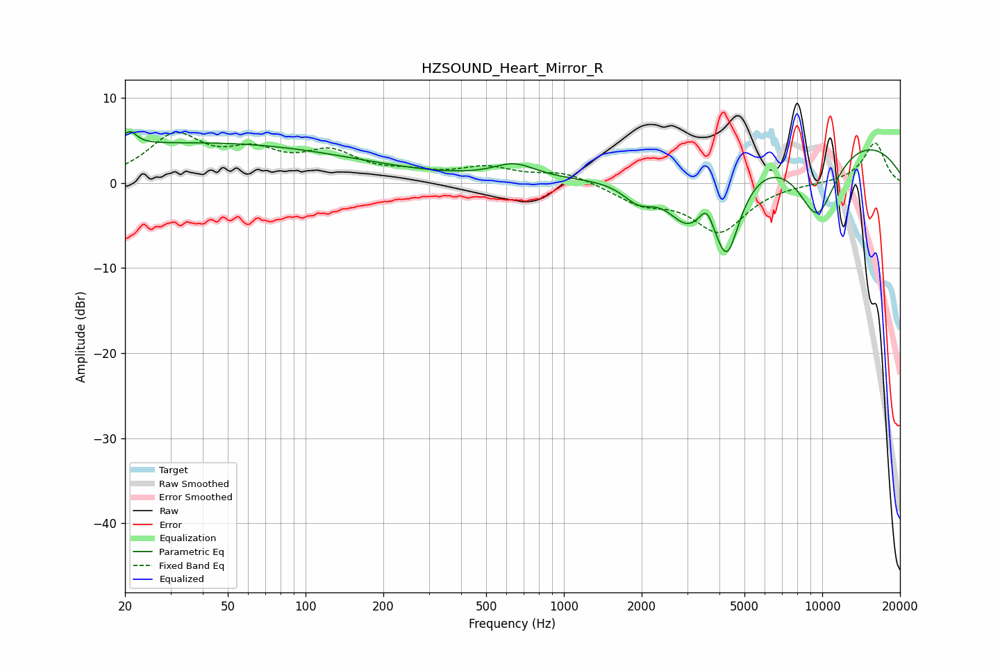

# HZSOUND_Heart_Mirror_R
See [usage instructions](https://github.com/jaakkopasanen/AutoEq#usage) for more options and info.

### Parametric EQs
Apply preamp of -6.1 dB when using parametric equalizer.

|   # | Type    |   Fc (Hz) |    Q |   Gain (dB) |
|-----|---------|-----------|------|-------------|
|   1 | Peaking |        21 | 5.53 |         1.6 |
|   2 | Peaking |        29 | 0.18 |         4.3 |
|   3 | Peaking |       106 | 0.26 |         0.6 |
|   4 | Peaking |       644 | 1.69 |         1.8 |
|   5 | Peaking |      1945 | 2.28 |        -2.4 |
|   6 | Peaking |      2993 | 1.73 |        -5.3 |
|   7 | Peaking |      3565 | 5.39 |         2.2 |
|   8 | Peaking |      4273 | 2.57 |        -9.9 |
|   9 | Peaking |      9550 | 1.49 |        -9.2 |
|  10 | Peaking |     10000 | 0.26 |         6.2 |

### Fixed Band EQs
When using fixed band (also called graphic) equalizer, apply preamp of **-6.0 dB** (if available) and set gains manually with these parameters.

|   # | Type    |   Fc (Hz) |    Q |   Gain (dB) |
|-----|---------|-----------|------|-------------|
|   1 | Peaking |        31 | 1.41 |         5.3 |
|   2 | Peaking |        62 | 1.41 |         3   |
|   3 | Peaking |       125 | 1.41 |         3.1 |
|   4 | Peaking |       250 | 1.41 |         0.9 |
|   5 | Peaking |       500 | 1.41 |         1.6 |
|   6 | Peaking |      1000 | 1.41 |         1.3 |
|   7 | Peaking |      2000 | 1.41 |        -2.1 |
|   8 | Peaking |      4000 | 1.41 |        -5.6 |
|   9 | Peaking |      8000 | 1.41 |         0   |
|  10 | Peaking |     16000 | 1.41 |         4.8 |

### Graphs

