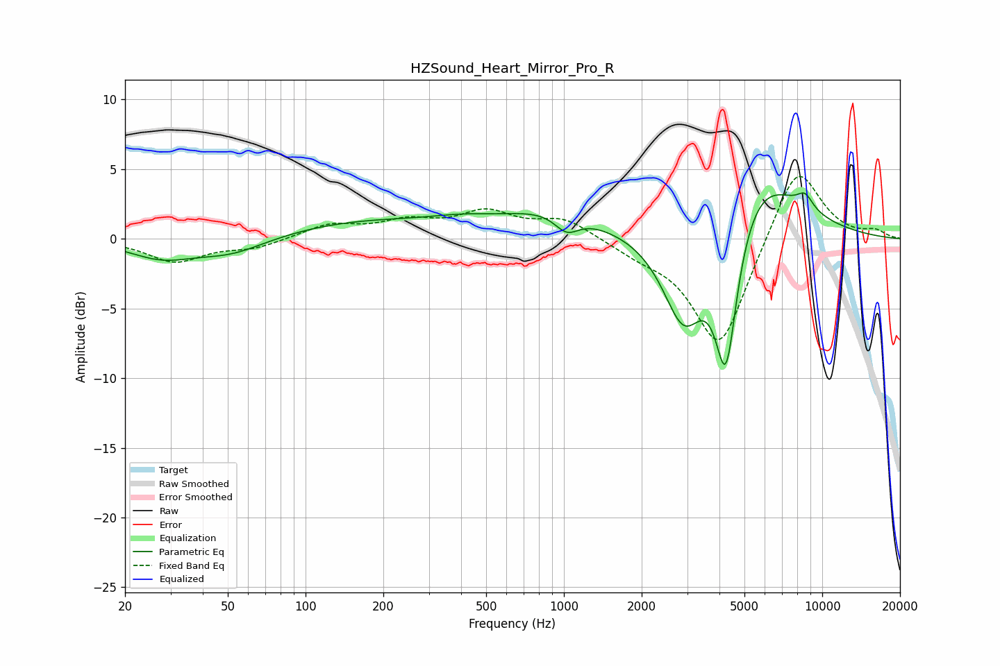

# HZSound_Heart_Mirror_Pro_R
See [usage instructions](https://github.com/jaakkopasanen/AutoEq#usage) for more options and info.

### Parametric EQs
Apply preamp of -3.4 dB when using parametric equalizer.

|   # | Type    |   Fc (Hz) |    Q |   Gain (dB) |
|-----|---------|-----------|------|-------------|
|   1 | Peaking |        28 | 1.14 |        -1.3 |
|   2 | Peaking |        52 | 1.02 |        -1.1 |
|   3 | Peaking |       169 | 0.45 |         1.2 |
|   4 | Peaking |       403 | 1.07 |         0.5 |
|   5 | Peaking |       918 | 0.73 |         1.8 |
|   6 | Peaking |      1026 | 2.95 |        -1.3 |
|   7 | Peaking |      2915 | 1.67 |        -7.1 |
|   8 | Peaking |      4242 | 2.99 |       -11.3 |
|   9 | Peaking |      5395 | 0.82 |         5.7 |
|  10 | Peaking |      8584 | 4.24 |         1   |

### Fixed Band EQs
When using fixed band (also called graphic) equalizer, apply preamp of **-4.6 dB** (if available) and set gains manually with these parameters.

|   # | Type    |   Fc (Hz) |    Q |   Gain (dB) |
|-----|---------|-----------|------|-------------|
|   1 | Peaking |        31 | 1.41 |        -1.6 |
|   2 | Peaking |        62 | 1.41 |        -0.6 |
|   3 | Peaking |       125 | 1.41 |         1   |
|   4 | Peaking |       250 | 1.41 |         1.1 |
|   5 | Peaking |       500 | 1.41 |         1.8 |
|   6 | Peaking |      1000 | 1.41 |         1.4 |
|   7 | Peaking |      2000 | 1.41 |        -0.8 |
|   8 | Peaking |      4000 | 1.41 |        -8   |
|   9 | Peaking |      8000 | 1.41 |         5.7 |
|  10 | Peaking |     16000 | 1.41 |         0.5 |

### Graphs

