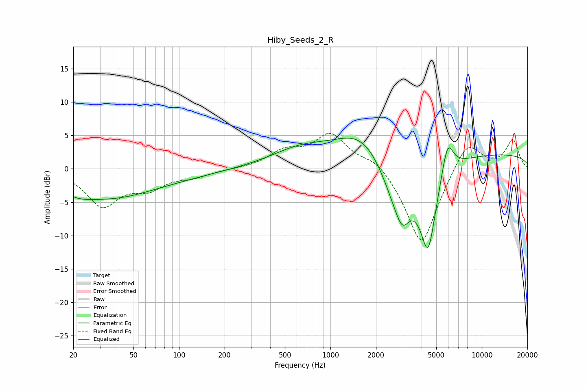

# Hiby_Seeds_2_R
See [usage instructions](https://github.com/jaakkopasanen/AutoEq#usage) for more options and info.

### Parametric EQs
Apply preamp of -4.7 dB when using parametric equalizer.

|   # | Type    |   Fc (Hz) |    Q |   Gain (dB) |
|-----|---------|-----------|------|-------------|
|   1 | Peaking |        21 | 1.12 |        -1.9 |
|   2 | Peaking |        37 | 0.58 |        -3.1 |
|   3 | Peaking |        81 | 0.48 |        -1.1 |
|   4 | Peaking |       635 | 0.7  |         2.6 |
|   5 | Peaking |      1636 | 0.8  |         5.2 |
|   6 | Peaking |      2764 | 1.3  |        -7.4 |
|   7 | Peaking |      2998 | 3.32 |        -3   |
|   8 | Peaking |      4420 | 2.45 |       -12.7 |
|   9 | Peaking |      5931 | 3.56 |         5.3 |
|  10 | Peaking |      9937 | 0.18 |         2.3 |

### Fixed Band EQs
When using fixed band (also called graphic) equalizer, apply preamp of **-5.4 dB** (if available) and set gains manually with these parameters.

|   # | Type    |   Fc (Hz) |    Q |   Gain (dB) |
|-----|---------|-----------|------|-------------|
|   1 | Peaking |        31 | 1.41 |        -5.3 |
|   2 | Peaking |        62 | 1.41 |        -2.5 |
|   3 | Peaking |       125 | 1.41 |        -1   |
|   4 | Peaking |       250 | 1.41 |        -0   |
|   5 | Peaking |       500 | 1.41 |         2.4 |
|   6 | Peaking |      1000 | 1.41 |         5   |
|   7 | Peaking |      2000 | 1.41 |         1.9 |
|   8 | Peaking |      4000 | 1.41 |       -11.9 |
|   9 | Peaking |      8000 | 1.41 |         4.7 |
|  10 | Peaking |     16000 | 1.41 |         4.3 |

### Graphs

