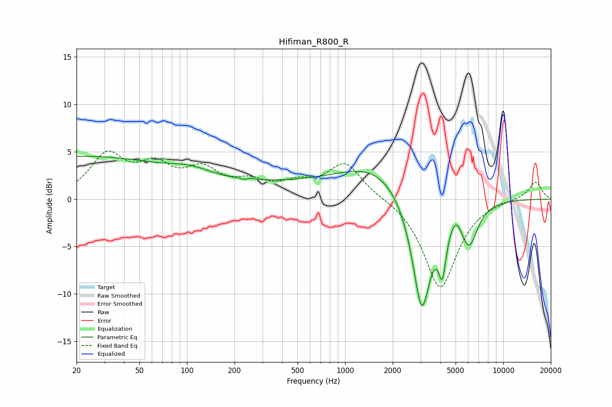

# Hifiman_R800_R
See [usage instructions](https://github.com/jaakkopasanen/AutoEq#usage) for more options and info.

### Parametric EQs
Apply preamp of -4.6 dB when using parametric equalizer.

|   # | Type    |   Fc (Hz) |    Q |   Gain (dB) |
|-----|---------|-----------|------|-------------|
|   1 | Peaking |        20 | 0.22 |         4.4 |
|   2 | Peaking |       106 | 1.03 |         1   |
|   3 | Peaking |       237 | 6    |        -3.1 |
|   4 | Peaking |       237 | 5.77 |         3.1 |
|   5 | Peaking |       516 | 0.24 |         1.4 |
|   6 | Peaking |      1639 | 0.62 |         2.8 |
|   7 | Peaking |      3049 | 2.24 |       -12.8 |
|   8 | Peaking |      4122 | 5.98 |        -4.8 |
|   9 | Peaking |      5032 | 4.57 |         1.1 |
|  10 | Peaking |      6095 | 2.58 |        -4.3 |

### Fixed Band EQs
When using fixed band (also called graphic) equalizer, apply preamp of **-5.2 dB** (if available) and set gains manually with these parameters.

|   # | Type    |   Fc (Hz) |    Q |   Gain (dB) |
|-----|---------|-----------|------|-------------|
|   1 | Peaking |        31 | 1.41 |         4.4 |
|   2 | Peaking |        62 | 1.41 |         3   |
|   3 | Peaking |       125 | 1.41 |         2.7 |
|   4 | Peaking |       250 | 1.41 |         1.4 |
|   5 | Peaking |       500 | 1.41 |         1.3 |
|   6 | Peaking |      1000 | 1.41 |         3.7 |
|   7 | Peaking |      2000 | 1.41 |         0.2 |
|   8 | Peaking |      4000 | 1.41 |        -9.4 |
|   9 | Peaking |      8000 | 1.41 |         0   |
|  10 | Peaking |     16000 | 1.41 |         1.9 |

### Graphs

