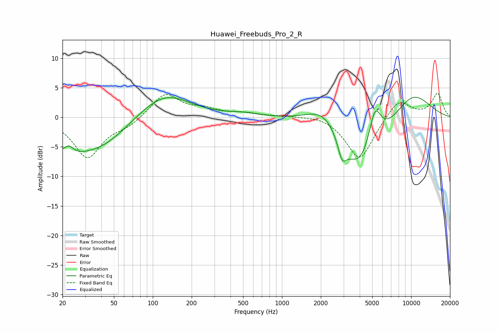

# Huawei_Freebuds_Pro_2_R
See [usage instructions](https://github.com/jaakkopasanen/AutoEq#usage) for more options and info.

### Parametric EQs
Apply preamp of -3.5 dB when using parametric equalizer.

|   # | Type    |   Fc (Hz) |    Q |   Gain (dB) |
|-----|---------|-----------|------|-------------|
|   1 | Peaking |        21 | 0.77 |        -5   |
|   2 | Peaking |        22 | 3.83 |         1.5 |
|   3 | Peaking |        42 | 0.73 |        -3.5 |
|   4 | Peaking |       123 | 0.73 |         4.3 |
|   5 | Peaking |       521 | 1.22 |         0.5 |
|   6 | Peaking |      2150 | 1.01 |         4.6 |
|   7 | Peaking |      2925 | 4.41 |        -3.2 |
|   8 | Peaking |      4042 | 0.78 |       -11.1 |
|   9 | Peaking |      5237 | 2.67 |         7.3 |
|  10 | Peaking |     10000 | 0.77 |         5.2 |

### Fixed Band EQs
When using fixed band (also called graphic) equalizer, apply preamp of **-4.1 dB** (if available) and set gains manually with these parameters.

|   # | Type    |   Fc (Hz) |    Q |   Gain (dB) |
|-----|---------|-----------|------|-------------|
|   1 | Peaking |        31 | 1.41 |        -6.8 |
|   2 | Peaking |        62 | 1.41 |        -1.3 |
|   3 | Peaking |       125 | 1.41 |         4.1 |
|   4 | Peaking |       250 | 1.41 |         1.2 |
|   5 | Peaking |       500 | 1.41 |         0.6 |
|   6 | Peaking |      1000 | 1.41 |         0.2 |
|   7 | Peaking |      2000 | 1.41 |         0.5 |
|   8 | Peaking |      4000 | 1.41 |        -7.3 |
|   9 | Peaking |      8000 | 1.41 |         3.3 |
|  10 | Peaking |     16000 | 1.41 |         4   |

### Graphs

