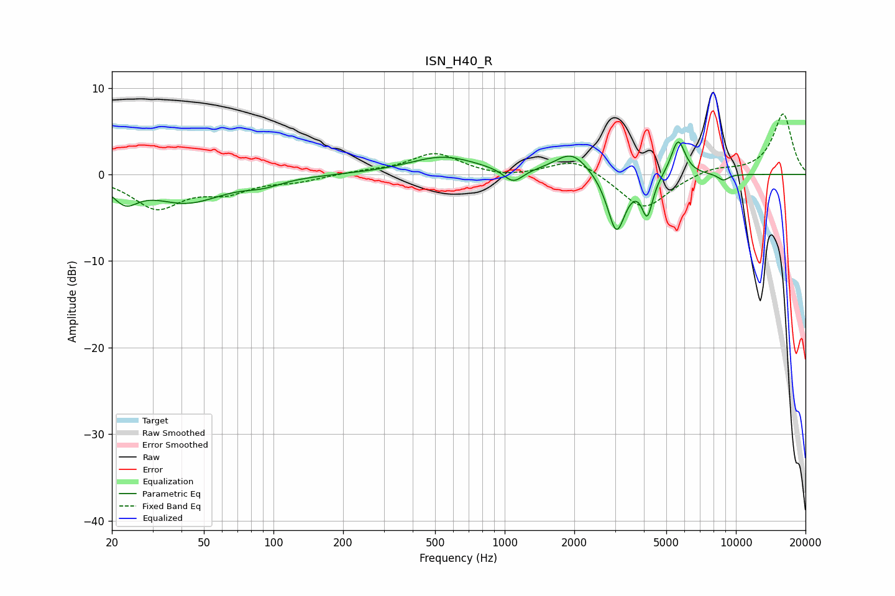

# ISN_H40_R
See [usage instructions](https://github.com/jaakkopasanen/AutoEq#usage) for more options and info.

### Parametric EQs
Apply preamp of -3.9 dB when using parametric equalizer.

|   # | Type    |   Fc (Hz) |    Q |   Gain (dB) |
|-----|---------|-----------|------|-------------|
|   1 | Peaking |        23 | 2.6  |        -2.4 |
|   2 | Peaking |        42 | 0.92 |        -3.1 |
|   3 | Peaking |        90 | 1.72 |        -0.8 |
|   4 | Peaking |       541 | 0.95 |         2   |
|   5 | Peaking |      1089 | 3.38 |        -1.6 |
|   6 | Peaking |      1955 | 1.93 |         2.6 |
|   7 | Peaking |      3042 | 3.6  |        -6.8 |
|   8 | Peaking |      4138 | 5.98 |        -4.4 |
|   9 | Peaking |      5625 | 4.59 |         4.2 |
|  10 | Peaking |      8819 | 5.31 |        -0.7 |

### Fixed Band EQs
When using fixed band (also called graphic) equalizer, apply preamp of **-7.1 dB** (if available) and set gains manually with these parameters.

|   # | Type    |   Fc (Hz) |    Q |   Gain (dB) |
|-----|---------|-----------|------|-------------|
|   1 | Peaking |        31 | 1.41 |        -3.7 |
|   2 | Peaking |        62 | 1.41 |        -1.8 |
|   3 | Peaking |       125 | 1.41 |        -0.7 |
|   4 | Peaking |       250 | 1.41 |         0.3 |
|   5 | Peaking |       500 | 1.41 |         2.4 |
|   6 | Peaking |      1000 | 1.41 |        -0.4 |
|   7 | Peaking |      2000 | 1.41 |         1.9 |
|   8 | Peaking |      4000 | 1.41 |        -4.2 |
|   9 | Peaking |      8000 | 1.41 |         0.8 |
|  10 | Peaking |     16000 | 1.41 |         7   |

### Graphs

