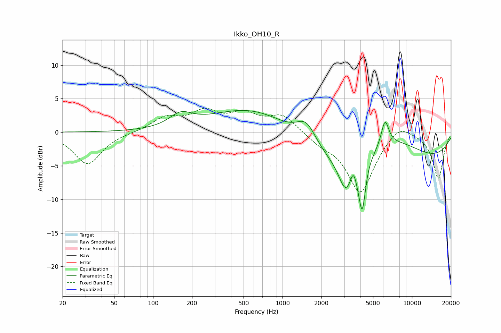

# Ikko_OH10_R
See [usage instructions](https://github.com/jaakkopasanen/AutoEq#usage) for more options and info.

### Parametric EQs
Apply preamp of -3.3 dB when using parametric equalizer.

|   # | Type    |   Fc (Hz) |    Q |   Gain (dB) |
|-----|---------|-----------|------|-------------|
|   1 | Peaking |       164 | 1.63 |         1.9 |
|   2 | Peaking |       763 | 0.4  |         5.9 |
|   3 | Peaking |      1528 | 1.84 |         3.4 |
|   4 | Peaking |      3085 | 2.62 |        -4.6 |
|   5 | Peaking |      3527 | 6    |         2.2 |
|   6 | Peaking |      3953 | 3.57 |        -2.1 |
|   7 | Peaking |      4142 | 6    |        -5.9 |
|   8 | Peaking |      5256 | 0.18 |       -10.8 |
|   9 | Peaking |      6196 | 4.61 |         3.9 |
|  10 | Peaking |      7159 | 0.44 |         8.5 |

### Fixed Band EQs
When using fixed band (also called graphic) equalizer, apply preamp of **-3.7 dB** (if available) and set gains manually with these parameters.

|   # | Type    |   Fc (Hz) |    Q |   Gain (dB) |
|-----|---------|-----------|------|-------------|
|   1 | Peaking |        31 | 1.41 |        -4.8 |
|   2 | Peaking |        62 | 1.41 |        -0   |
|   3 | Peaking |       125 | 1.41 |         2   |
|   4 | Peaking |       250 | 1.41 |         2.7 |
|   5 | Peaking |       500 | 1.41 |         2.4 |
|   6 | Peaking |      1000 | 1.41 |         2.5 |
|   7 | Peaking |      2000 | 1.41 |        -1.3 |
|   8 | Peaking |      4000 | 1.41 |        -8.9 |
|   9 | Peaking |      8000 | 1.41 |         1.8 |
|  10 | Peaking |     16000 | 1.41 |        -6.9 |

### Graphs

