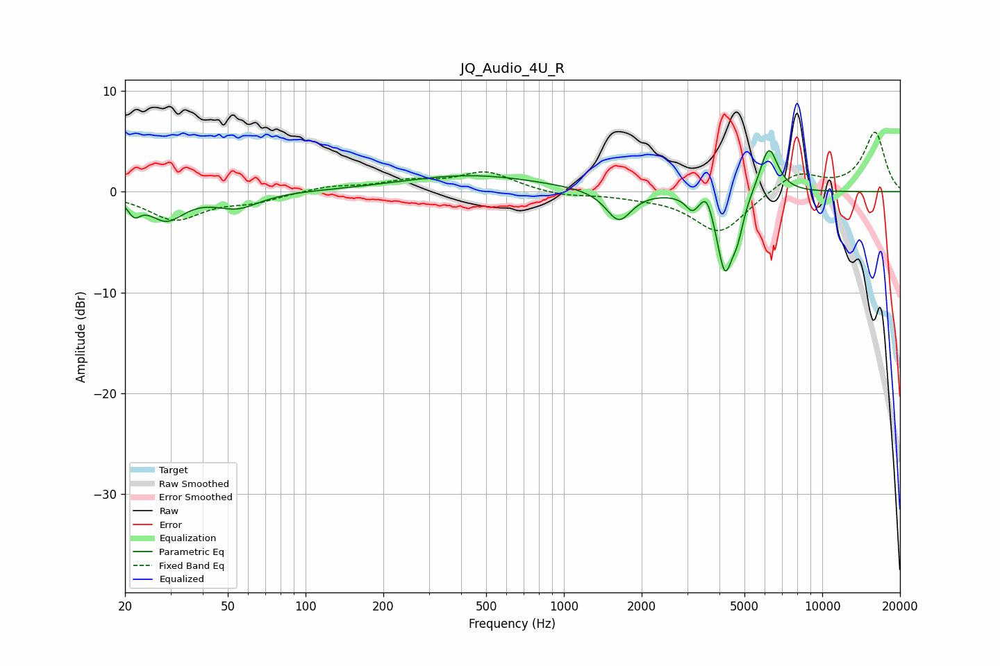

# JQ_Audio_4U_R
See [usage instructions](https://github.com/jaakkopasanen/AutoEq#usage) for more options and info.

### Parametric EQs
Apply preamp of -4.2 dB when using parametric equalizer.

|   # | Type    |   Fc (Hz) |    Q |   Gain (dB) |
|-----|---------|-----------|------|-------------|
|   1 | Peaking |        22 | 5.99 |        -1.4 |
|   2 | Peaking |        29 | 2.09 |        -2.6 |
|   3 | Peaking |        54 | 1.68 |        -1.5 |
|   4 | Peaking |       437 | 0.53 |         1.6 |
|   5 | Peaking |      1631 | 2.89 |        -3.1 |
|   6 | Peaking |      3137 | 5.88 |        -1.3 |
|   7 | Peaking |      3576 | 5.99 |         1.7 |
|   8 | Peaking |      4199 | 4.36 |        -7.7 |
|   9 | Peaking |      4703 | 5.98 |        -2.5 |
|  10 | Peaking |      6209 | 3.87 |         4.8 |

### Fixed Band EQs
When using fixed band (also called graphic) equalizer, apply preamp of **-6.0 dB** (if available) and set gains manually with these parameters.

|   # | Type    |   Fc (Hz) |    Q |   Gain (dB) |
|-----|---------|-----------|------|-------------|
|   1 | Peaking |        31 | 1.41 |        -2.7 |
|   2 | Peaking |        62 | 1.41 |        -0.9 |
|   3 | Peaking |       125 | 1.41 |         0.5 |
|   4 | Peaking |       250 | 1.41 |         0.9 |
|   5 | Peaking |       500 | 1.41 |         1.9 |
|   6 | Peaking |      1000 | 1.41 |        -0.4 |
|   7 | Peaking |      2000 | 1.41 |        -0.3 |
|   8 | Peaking |      4000 | 1.41 |        -4.1 |
|   9 | Peaking |      8000 | 1.41 |         2   |
|  10 | Peaking |     16000 | 1.41 |         5.9 |

### Graphs

