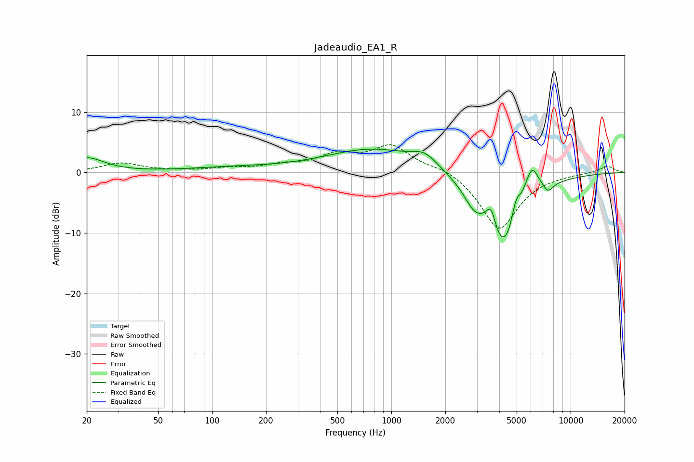

# Jadeaudio_EA1_R
See [usage instructions](https://github.com/jaakkopasanen/AutoEq#usage) for more options and info.

### Parametric EQs
Apply preamp of -4.0 dB when using parametric equalizer.

|   # | Type    |   Fc (Hz) |    Q |   Gain (dB) |
|-----|---------|-----------|------|-------------|
|   1 | Peaking |        20 | 1.47 |         2.4 |
|   2 | Peaking |       130 | 0.54 |         0.7 |
|   3 | Peaking |       801 | 0.53 |         3.9 |
|   4 | Peaking |      1538 | 1.98 |         2   |
|   5 | Peaking |      2878 | 2.75 |        -2.5 |
|   6 | Peaking |      3595 | 5.53 |         3.5 |
|   7 | Peaking |      4243 | 1.39 |       -13   |
|   8 | Peaking |      4962 | 5.7  |         3.4 |
|   9 | Peaking |      6041 | 3.28 |         5.7 |
|  10 | Peaking |      7475 | 4.82 |        -1.5 |

### Fixed Band EQs
When using fixed band (also called graphic) equalizer, apply preamp of **-4.7 dB** (if available) and set gains manually with these parameters.

|   # | Type    |   Fc (Hz) |    Q |   Gain (dB) |
|-----|---------|-----------|------|-------------|
|   1 | Peaking |        31 | 1.41 |         1.5 |
|   2 | Peaking |        62 | 1.41 |         0.2 |
|   3 | Peaking |       125 | 1.41 |         0.6 |
|   4 | Peaking |       250 | 1.41 |         1   |
|   5 | Peaking |       500 | 1.41 |         2.6 |
|   6 | Peaking |      1000 | 1.41 |         4.2 |
|   7 | Peaking |      2000 | 1.41 |         1   |
|   8 | Peaking |      4000 | 1.41 |        -9.5 |
|   9 | Peaking |      8000 | 1.41 |        -0.2 |
|  10 | Peaking |     16000 | 1.41 |         1.1 |

### Graphs

