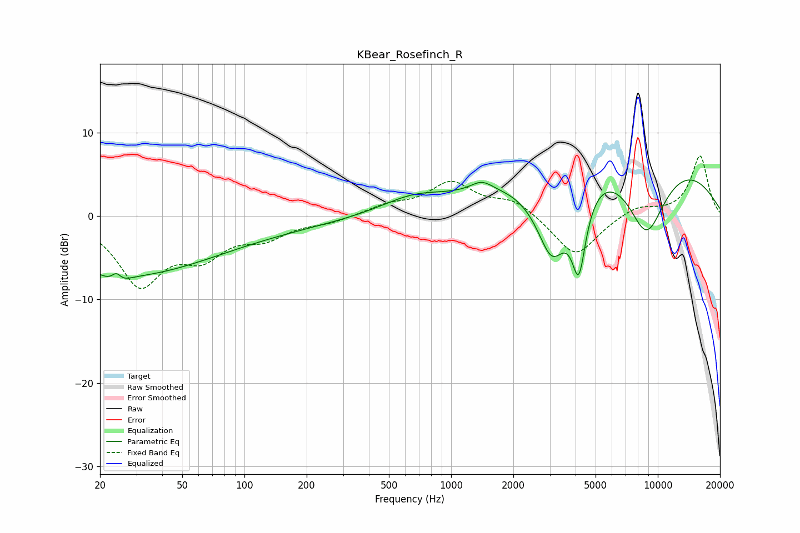

# KBear_Rosefinch_R
See [usage instructions](https://github.com/jaakkopasanen/AutoEq#usage) for more options and info.

### Parametric EQs
Apply preamp of -4.4 dB when using parametric equalizer.

|   # | Type    |   Fc (Hz) |    Q |   Gain (dB) |
|-----|---------|-----------|------|-------------|
|   1 | Peaking |        24 | 5.08 |         3.3 |
|   2 | Peaking |        24 | 3.79 |        -3.2 |
|   3 | Peaking |        26 | 0.34 |        -5.4 |
|   4 | Peaking |        52 | 0.19 |        -1.6 |
|   5 | Peaking |       657 | 0.89 |         1.9 |
|   6 | Peaking |      1405 | 2.69 |         1.2 |
|   7 | Peaking |      3080 | 1.65 |       -10.4 |
|   8 | Peaking |      4149 | 3.92 |        -9.4 |
|   9 | Peaking |      6834 | 0.26 |        10.3 |
|  10 | Peaking |      8794 | 1.18 |       -10.9 |

### Fixed Band EQs
When using fixed band (also called graphic) equalizer, apply preamp of **-7.3 dB** (if available) and set gains manually with these parameters.

|   # | Type    |   Fc (Hz) |    Q |   Gain (dB) |
|-----|---------|-----------|------|-------------|
|   1 | Peaking |        31 | 1.41 |        -7.9 |
|   2 | Peaking |        62 | 1.41 |        -4   |
|   3 | Peaking |       125 | 1.41 |        -2.2 |
|   4 | Peaking |       250 | 1.41 |        -0.7 |
|   5 | Peaking |       500 | 1.41 |         1.1 |
|   6 | Peaking |      1000 | 1.41 |         3.8 |
|   7 | Peaking |      2000 | 1.41 |         1.9 |
|   8 | Peaking |      4000 | 1.41 |        -5   |
|   9 | Peaking |      8000 | 1.41 |         1.2 |
|  10 | Peaking |     16000 | 1.41 |         7.2 |

### Graphs

