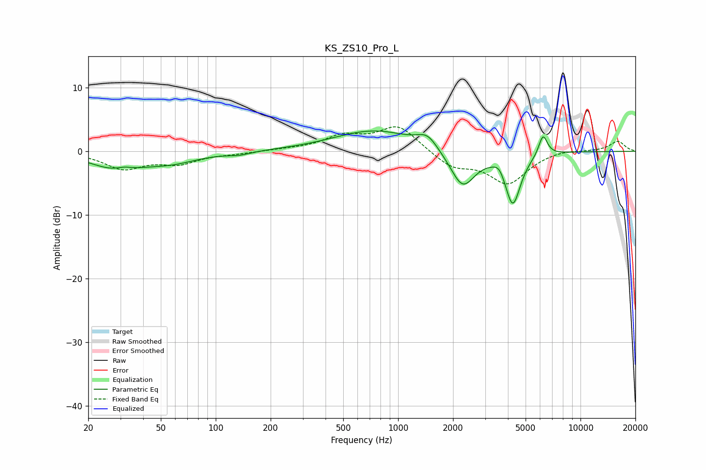

# KS_ZS10_Pro_L
See [usage instructions](https://github.com/jaakkopasanen/AutoEq#usage) for more options and info.

### Parametric EQs
Apply preamp of -3.3 dB when using parametric equalizer.

|   # | Type    |   Fc (Hz) |    Q |   Gain (dB) |
|-----|---------|-----------|------|-------------|
|   1 | Peaking |        29 | 1.02 |        -2.6 |
|   2 | Peaking |        31 | 3.04 |         0.6 |
|   3 | Peaking |        57 | 0.96 |        -1.4 |
|   4 | Peaking |       135 | 2.37 |        -0.4 |
|   5 | Peaking |       744 | 0.63 |         3.3 |
|   6 | Peaking |      1449 | 2.6  |         2   |
|   7 | Peaking |      2258 | 2.06 |        -5.9 |
|   8 | Peaking |      3584 | 4.79 |         1.2 |
|   9 | Peaking |      4254 | 3.29 |        -8.2 |
|  10 | Peaking |      6231 | 5.75 |         3.3 |

### Fixed Band EQs
When using fixed band (also called graphic) equalizer, apply preamp of **-3.9 dB** (if available) and set gains manually with these parameters.

|   # | Type    |   Fc (Hz) |    Q |   Gain (dB) |
|-----|---------|-----------|------|-------------|
|   1 | Peaking |        31 | 1.41 |        -2.6 |
|   2 | Peaking |        62 | 1.41 |        -1.7 |
|   3 | Peaking |       125 | 1.41 |        -0.3 |
|   4 | Peaking |       250 | 1.41 |         0.2 |
|   5 | Peaking |       500 | 1.41 |         2.2 |
|   6 | Peaking |      1000 | 1.41 |         4   |
|   7 | Peaking |      2000 | 1.41 |        -2.4 |
|   8 | Peaking |      4000 | 1.41 |        -4.9 |
|   9 | Peaking |      8000 | 1.41 |         0.4 |
|  10 | Peaking |     16000 | 1.41 |         1.6 |

### Graphs

