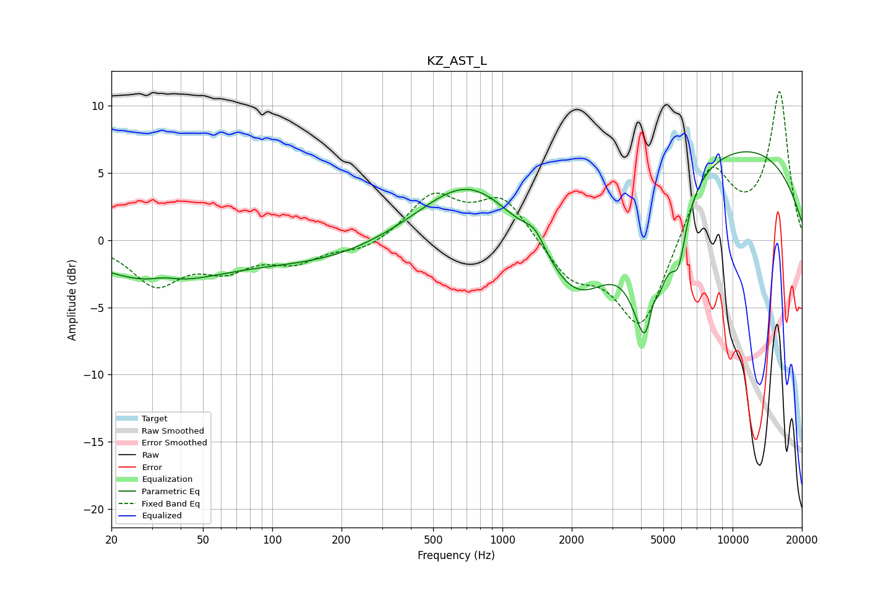

# KZ_AST_L
See [usage instructions](https://github.com/jaakkopasanen/AutoEq#usage) for more options and info.

### Parametric EQs
Apply preamp of -6.7 dB when using parametric equalizer.

|   # | Type    |   Fc (Hz) |    Q |   Gain (dB) |
|-----|---------|-----------|------|-------------|
|   1 | Peaking |        31 | 0.52 |        -2.9 |
|   2 | Peaking |        34 | 2.49 |         0.4 |
|   3 | Peaking |       161 | 0.45 |        -1.5 |
|   4 | Peaking |       720 | 0.67 |         4.8 |
|   5 | Peaking |      1384 | 3.04 |         1.4 |
|   6 | Peaking |      2135 | 0.83 |        -6.8 |
|   7 | Peaking |      4313 | 2.21 |       -11.9 |
|   8 | Peaking |      4465 | 6    |         3.2 |
|   9 | Peaking |      5826 | 4.32 |        -3.7 |
|  10 | Peaking |      9300 | 0.25 |         7.4 |

### Fixed Band EQs
When using fixed band (also called graphic) equalizer, apply preamp of **-11.1 dB** (if available) and set gains manually with these parameters.

|   # | Type    |   Fc (Hz) |    Q |   Gain (dB) |
|-----|---------|-----------|------|-------------|
|   1 | Peaking |        31 | 1.41 |        -3.1 |
|   2 | Peaking |        62 | 1.41 |        -1.8 |
|   3 | Peaking |       125 | 1.41 |        -1.4 |
|   4 | Peaking |       250 | 1.41 |        -0.8 |
|   5 | Peaking |       500 | 1.41 |         3.2 |
|   6 | Peaking |      1000 | 1.41 |         3.2 |
|   7 | Peaking |      2000 | 1.41 |        -2.6 |
|   8 | Peaking |      4000 | 1.41 |        -6.8 |
|   9 | Peaking |      8000 | 1.41 |         5.8 |
|  10 | Peaking |     16000 | 1.41 |        10.9 |

### Graphs

