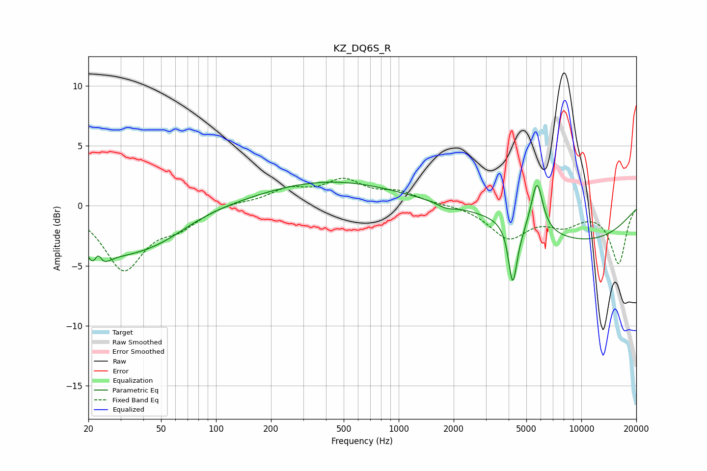

# KZ_DQ6S_R
See [usage instructions](https://github.com/jaakkopasanen/AutoEq#usage) for more options and info.

### Parametric EQs
Apply preamp of -2.1 dB when using parametric equalizer.

|   # | Type    |   Fc (Hz) |    Q |   Gain (dB) |
|-----|---------|-----------|------|-------------|
|   1 | Peaking |        22 | 3.52 |        -4.1 |
|   2 | Peaking |        23 | 5.88 |         3   |
|   3 | Peaking |        30 | 0.7  |        -3.2 |
|   4 | Peaking |        52 | 0.87 |        -1.2 |
|   5 | Peaking |       422 | 0.38 |         2   |
|   6 | Peaking |      1814 | 3.09 |        -0.4 |
|   7 | Peaking |      4214 | 6    |        -5.1 |
|   8 | Peaking |      4738 | 5.89 |        -0.4 |
|   9 | Peaking |      5722 | 4.44 |         4.2 |
|  10 | Peaking |     10000 | 0.37 |        -2.8 |

### Fixed Band EQs
When using fixed band (also called graphic) equalizer, apply preamp of **-2.4 dB** (if available) and set gains manually with these parameters.

|   # | Type    |   Fc (Hz) |    Q |   Gain (dB) |
|-----|---------|-----------|------|-------------|
|   1 | Peaking |        31 | 1.41 |        -5.2 |
|   2 | Peaking |        62 | 1.41 |        -1.4 |
|   3 | Peaking |       125 | 1.41 |         0.3 |
|   4 | Peaking |       250 | 1.41 |         1.2 |
|   5 | Peaking |       500 | 1.41 |         1.9 |
|   6 | Peaking |      1000 | 1.41 |         1   |
|   7 | Peaking |      2000 | 1.41 |         0.1 |
|   8 | Peaking |      4000 | 1.41 |        -2.6 |
|   9 | Peaking |      8000 | 1.41 |        -1.3 |
|  10 | Peaking |     16000 | 1.41 |        -4.8 |

### Graphs

