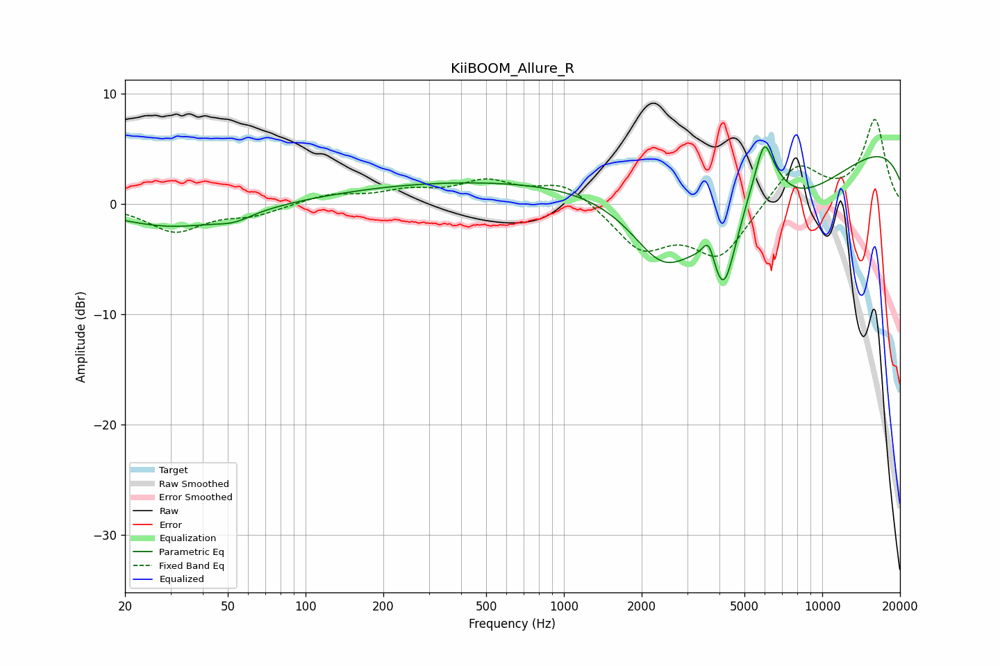

# KiiBOOM_Allure_R
See [usage instructions](https://github.com/jaakkopasanen/AutoEq#usage) for more options and info.

### Parametric EQs
Apply preamp of -5.3 dB when using parametric equalizer.

|   # | Type    |   Fc (Hz) |    Q |   Gain (dB) |
|-----|---------|-----------|------|-------------|
|   1 | Peaking |        31 | 0.65 |        -2.1 |
|   2 | Peaking |        53 | 2.1  |        -0.7 |
|   3 | Peaking |       687 | 0.18 |         2.2 |
|   4 | Peaking |      2418 | 1.13 |        -5.6 |
|   5 | Peaking |      3636 | 6    |         2.2 |
|   6 | Peaking |      4151 | 3.08 |        -6.2 |
|   7 | Peaking |      5455 | 0.43 |        -8.5 |
|   8 | Peaking |      5897 | 1.83 |         6.2 |
|   9 | Peaking |      5975 | 5.62 |         2.2 |
|  10 | Peaking |     10000 | 0.18 |         6.7 |

### Fixed Band EQs
When using fixed band (also called graphic) equalizer, apply preamp of **-7.7 dB** (if available) and set gains manually with these parameters.

|   # | Type    |   Fc (Hz) |    Q |   Gain (dB) |
|-----|---------|-----------|------|-------------|
|   1 | Peaking |        31 | 1.41 |        -2.5 |
|   2 | Peaking |        62 | 1.41 |        -0.9 |
|   3 | Peaking |       125 | 1.41 |         0.8 |
|   4 | Peaking |       250 | 1.41 |         1   |
|   5 | Peaking |       500 | 1.41 |         1.9 |
|   6 | Peaking |      1000 | 1.41 |         2   |
|   7 | Peaking |      2000 | 1.41 |        -4   |
|   8 | Peaking |      4000 | 1.41 |        -4.7 |
|   9 | Peaking |      8000 | 1.41 |         3.7 |
|  10 | Peaking |     16000 | 1.41 |         7.5 |

### Graphs

