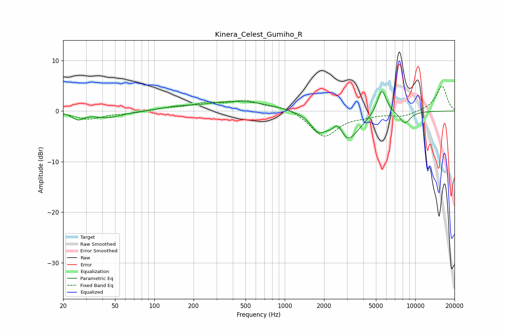

# Kinera_Celest_Gumiho_R
See [usage instructions](https://github.com/jaakkopasanen/AutoEq#usage) for more options and info.

### Parametric EQs
Apply preamp of -3.9 dB when using parametric equalizer.

|   # | Type    |   Fc (Hz) |    Q |   Gain (dB) |
|-----|---------|-----------|------|-------------|
|   1 | Peaking |        26 | 3.33 |        -1.4 |
|   2 | Peaking |        44 | 1.29 |        -1.3 |
|   3 | Peaking |       149 | 1.28 |         0.5 |
|   4 | Peaking |       449 | 0.56 |         2   |
|   5 | Peaking |      1803 | 2.47 |        -3   |
|   6 | Peaking |      2492 | 6    |         1.3 |
|   7 | Peaking |      2690 | 4.52 |         1.5 |
|   8 | Peaking |      2955 | 1.49 |        -6.1 |
|   9 | Peaking |      5545 | 3.74 |         5.2 |
|  10 | Peaking |      8347 | 3.17 |        -2.3 |

### Fixed Band EQs
When using fixed band (also called graphic) equalizer, apply preamp of **-5.0 dB** (if available) and set gains manually with these parameters.

|   # | Type    |   Fc (Hz) |    Q |   Gain (dB) |
|-----|---------|-----------|------|-------------|
|   1 | Peaking |        31 | 1.41 |        -1.6 |
|   2 | Peaking |        62 | 1.41 |        -0.4 |
|   3 | Peaking |       125 | 1.41 |         0.5 |
|   4 | Peaking |       250 | 1.41 |         1.4 |
|   5 | Peaking |       500 | 1.41 |         1.9 |
|   6 | Peaking |      1000 | 1.41 |         1   |
|   7 | Peaking |      2000 | 1.41 |        -5.1 |
|   8 | Peaking |      4000 | 1.41 |        -0.7 |
|   9 | Peaking |      8000 | 1.41 |        -1   |
|  10 | Peaking |     16000 | 1.41 |         5   |

### Graphs

