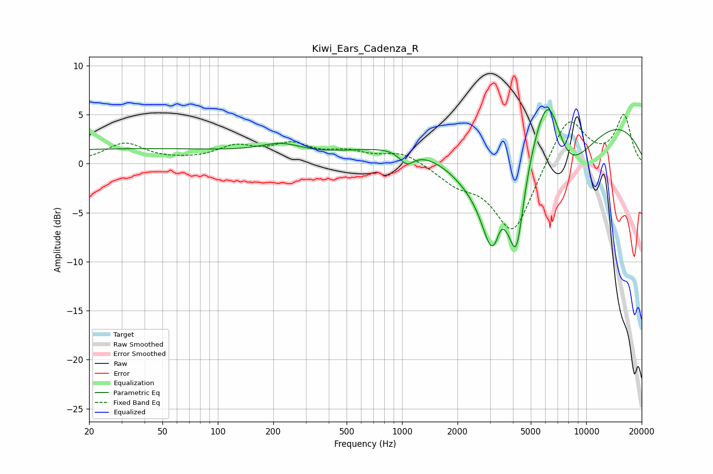

# Kiwi_Ears_Cadenza_R
See [usage instructions](https://github.com/jaakkopasanen/AutoEq#usage) for more options and info.

### Parametric EQs
Apply preamp of -5.6 dB when using parametric equalizer.

|   # | Type    |   Fc (Hz) |    Q |   Gain (dB) |
|-----|---------|-----------|------|-------------|
|   1 | Peaking |        35 | 0.18 |         1.5 |
|   2 | Peaking |       220 | 1.23 |         1.1 |
|   3 | Peaking |      1061 | 3.46 |        -1.4 |
|   4 | Peaking |      2769 | 0.57 |        -9.2 |
|   5 | Peaking |      3091 | 2.55 |        -6.4 |
|   6 | Peaking |      3442 | 6    |         1.1 |
|   7 | Peaking |      4179 | 3.31 |        -8.5 |
|   8 | Peaking |      5410 | 0.18 |        10.2 |
|   9 | Peaking |      6242 | 1.29 |        12.3 |
|  10 | Peaking |      7538 | 0.73 |       -13.1 |

### Fixed Band EQs
When using fixed band (also called graphic) equalizer, apply preamp of **-5.1 dB** (if available) and set gains manually with these parameters.

|   # | Type    |   Fc (Hz) |    Q |   Gain (dB) |
|-----|---------|-----------|------|-------------|
|   1 | Peaking |        31 | 1.41 |         2   |
|   2 | Peaking |        62 | 1.41 |         0.1 |
|   3 | Peaking |       125 | 1.41 |         1.5 |
|   4 | Peaking |       250 | 1.41 |         1.7 |
|   5 | Peaking |       500 | 1.41 |         1   |
|   6 | Peaking |      1000 | 1.41 |         1.2 |
|   7 | Peaking |      2000 | 1.41 |        -1.7 |
|   8 | Peaking |      4000 | 1.41 |        -7.2 |
|   9 | Peaking |      8000 | 1.41 |         5.1 |
|  10 | Peaking |     16000 | 1.41 |         4.8 |

### Graphs

