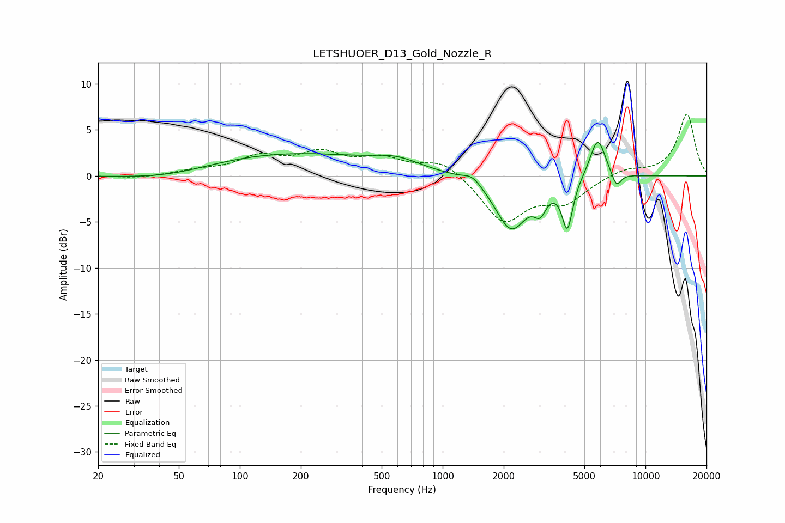

# LETSHUOER_D13_Gold_Nozzle_R
See [usage instructions](https://github.com/jaakkopasanen/AutoEq#usage) for more options and info.

### Parametric EQs
Apply preamp of -3.7 dB when using parametric equalizer.

|   # | Type    |   Fc (Hz) |    Q |   Gain (dB) |
|-----|---------|-----------|------|-------------|
|   1 | Peaking |        46 | 0.62 |        -1   |
|   2 | Peaking |       165 | 0.3  |         2.5 |
|   3 | Peaking |       591 | 1.26 |         1   |
|   4 | Peaking |      1402 | 3.23 |         0.9 |
|   5 | Peaking |      2177 | 1.8  |        -5.8 |
|   6 | Peaking |      3025 | 4.63 |        -2.1 |
|   7 | Peaking |      4120 | 5.36 |        -5.3 |
|   8 | Peaking |      5816 | 3.56 |         4.4 |
|   9 | Peaking |      6946 | 5.95 |        -0.3 |
|  10 | Peaking |      7229 | 6    |        -1.4 |

### Fixed Band EQs
When using fixed band (also called graphic) equalizer, apply preamp of **-6.8 dB** (if available) and set gains manually with these parameters.

|   # | Type    |   Fc (Hz) |    Q |   Gain (dB) |
|-----|---------|-----------|------|-------------|
|   1 | Peaking |        31 | 1.41 |        -0.3 |
|   2 | Peaking |        62 | 1.41 |         0.5 |
|   3 | Peaking |       125 | 1.41 |         1.9 |
|   4 | Peaking |       250 | 1.41 |         2.2 |
|   5 | Peaking |       500 | 1.41 |         1.7 |
|   6 | Peaking |      1000 | 1.41 |         1.8 |
|   7 | Peaking |      2000 | 1.41 |        -4.9 |
|   8 | Peaking |      4000 | 1.41 |        -2.6 |
|   9 | Peaking |      8000 | 1.41 |         0.8 |
|  10 | Peaking |     16000 | 1.41 |         6.7 |

### Graphs

