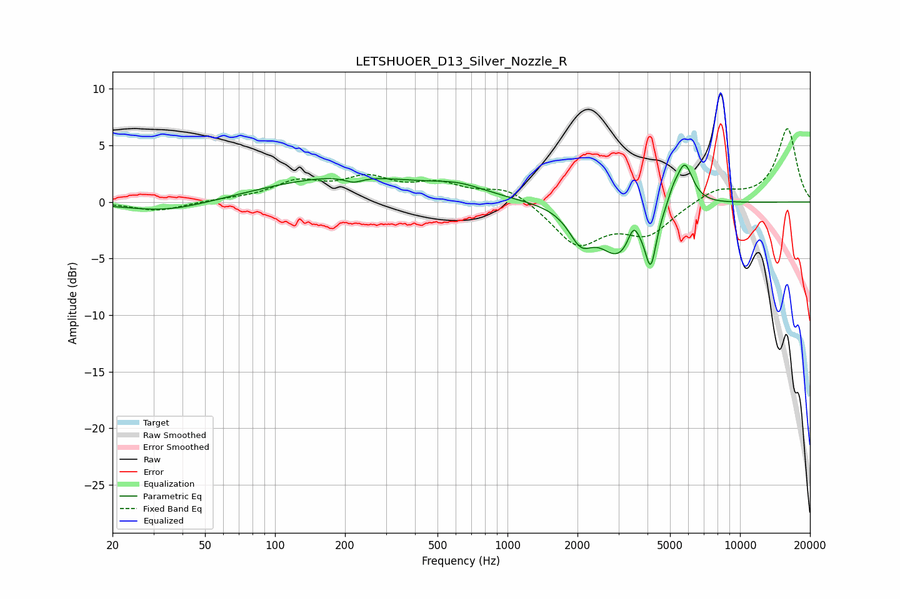

# LETSHUOER_D13_Silver_Nozzle_R
See [usage instructions](https://github.com/jaakkopasanen/AutoEq#usage) for more options and info.

### Parametric EQs
Apply preamp of -3.4 dB when using parametric equalizer.

|   # | Type    |   Fc (Hz) |    Q |   Gain (dB) |
|-----|---------|-----------|------|-------------|
|   1 | Peaking |        34 | 0.78 |        -0.9 |
|   2 | Peaking |       199 | 0.42 |         2.2 |
|   3 | Peaking |       218 | 3.64 |        -0.5 |
|   4 | Peaking |       618 | 1.17 |         0.9 |
|   5 | Peaking |      2065 | 2.74 |        -2.6 |
|   6 | Peaking |      3010 | 1.69 |        -4.4 |
|   7 | Peaking |      3480 | 6    |         1.7 |
|   8 | Peaking |      4131 | 5.99 |        -4.4 |
|   9 | Peaking |      5152 | 6    |         0.9 |
|  10 | Peaking |      5777 | 3.8  |         3.8 |

### Fixed Band EQs
When using fixed band (also called graphic) equalizer, apply preamp of **-6.6 dB** (if available) and set gains manually with these parameters.

|   # | Type    |   Fc (Hz) |    Q |   Gain (dB) |
|-----|---------|-----------|------|-------------|
|   1 | Peaking |        31 | 1.41 |        -0.8 |
|   2 | Peaking |        62 | 1.41 |         0.1 |
|   3 | Peaking |       125 | 1.41 |         1.6 |
|   4 | Peaking |       250 | 1.41 |         1.9 |
|   5 | Peaking |       500 | 1.41 |         1.4 |
|   6 | Peaking |      1000 | 1.41 |         1.3 |
|   7 | Peaking |      2000 | 1.41 |        -3.7 |
|   8 | Peaking |      4000 | 1.41 |        -2.7 |
|   9 | Peaking |      8000 | 1.41 |         1.2 |
|  10 | Peaking |     16000 | 1.41 |         6.5 |

### Graphs

