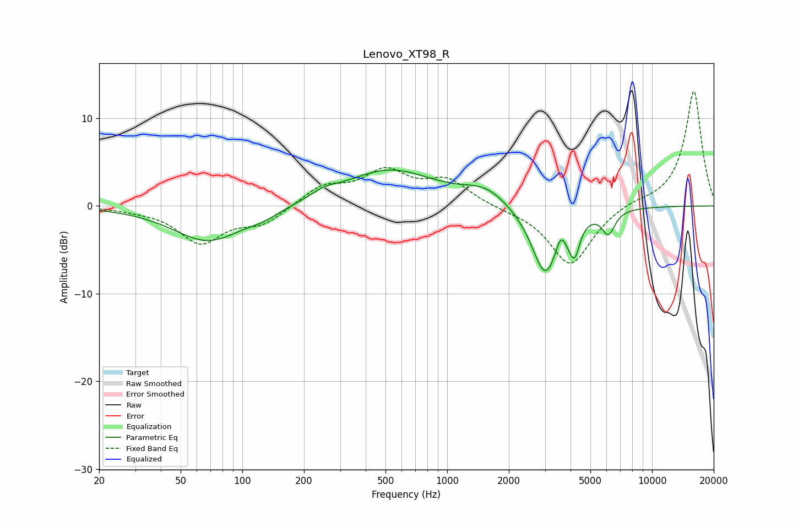

# Lenovo_XT98_R
See [usage instructions](https://github.com/jaakkopasanen/AutoEq#usage) for more options and info.

### Parametric EQs
Apply preamp of -4.2 dB when using parametric equalizer.

|   # | Type    |   Fc (Hz) |    Q |   Gain (dB) |
|-----|---------|-----------|------|-------------|
|   1 | Peaking |        68 | 0.83 |        -4   |
|   2 | Peaking |       128 | 1.94 |        -0.6 |
|   3 | Peaking |       250 | 2.28 |         0.7 |
|   4 | Peaking |       522 | 0.64 |         4.1 |
|   5 | Peaking |      1535 | 1.34 |         1.7 |
|   6 | Peaking |      3015 | 2.09 |        -8   |
|   7 | Peaking |      3579 | 6    |         1.9 |
|   8 | Peaking |      4034 | 4.66 |        -1.2 |
|   9 | Peaking |      4206 | 5.99 |        -2.7 |
|  10 | Peaking |      6127 | 4.46 |        -2.6 |

### Fixed Band EQs
When using fixed band (also called graphic) equalizer, apply preamp of **-13.2 dB** (if available) and set gains manually with these parameters.

|   # | Type    |   Fc (Hz) |    Q |   Gain (dB) |
|-----|---------|-----------|------|-------------|
|   1 | Peaking |        31 | 1.41 |        -0.3 |
|   2 | Peaking |        62 | 1.41 |        -4.1 |
|   3 | Peaking |       125 | 1.41 |        -1.9 |
|   4 | Peaking |       250 | 1.41 |         2.2 |
|   5 | Peaking |       500 | 1.41 |         3.6 |
|   6 | Peaking |      1000 | 1.41 |         2.7 |
|   7 | Peaking |      2000 | 1.41 |        -0.3 |
|   8 | Peaking |      4000 | 1.41 |        -6.8 |
|   9 | Peaking |      8000 | 1.41 |         0.5 |
|  10 | Peaking |     16000 | 1.41 |        13.2 |

### Graphs

