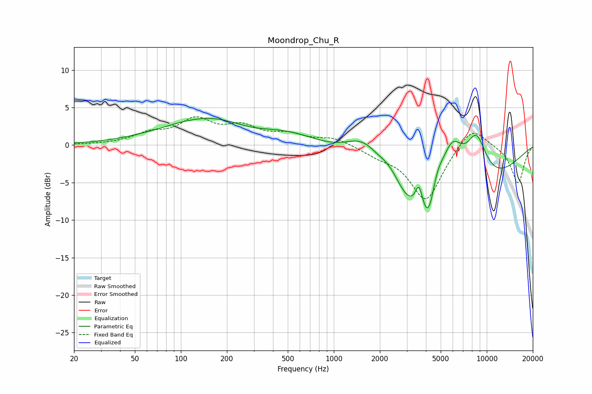

# Moondrop_Chu_R
See [usage instructions](https://github.com/jaakkopasanen/AutoEq#usage) for more options and info.

### Parametric EQs
Apply preamp of -3.7 dB when using parametric equalizer.

|   # | Type    |   Fc (Hz) |    Q |   Gain (dB) |
|-----|---------|-----------|------|-------------|
|   1 | Peaking |       257 | 0.36 |         6.4 |
|   2 | Peaking |       292 | 0.69 |        -3.6 |
|   3 | Peaking |      1576 | 1.04 |         5.7 |
|   4 | Peaking |      2335 | 1.76 |         2.9 |
|   5 | Peaking |      3602 | 5.71 |         3.4 |
|   6 | Peaking |      4194 | 3.43 |        -3.9 |
|   7 | Peaking |      4224 | 0.36 |       -13.7 |
|   8 | Peaking |      4689 | 2.81 |         4   |
|   9 | Peaking |      5924 | 1.55 |         9.3 |
|  10 | Peaking |      8536 | 1.77 |         6.9 |

### Fixed Band EQs
When using fixed band (also called graphic) equalizer, apply preamp of **-3.9 dB** (if available) and set gains manually with these parameters.

|   # | Type    |   Fc (Hz) |    Q |   Gain (dB) |
|-----|---------|-----------|------|-------------|
|   1 | Peaking |        31 | 1.41 |         0   |
|   2 | Peaking |        62 | 1.41 |         1.3 |
|   3 | Peaking |       125 | 1.41 |         3.1 |
|   4 | Peaking |       250 | 1.41 |         2.1 |
|   5 | Peaking |       500 | 1.41 |         1.2 |
|   6 | Peaking |      1000 | 1.41 |         1   |
|   7 | Peaking |      2000 | 1.41 |        -1   |
|   8 | Peaking |      4000 | 1.41 |        -7.4 |
|   9 | Peaking |      8000 | 1.41 |         2.9 |
|  10 | Peaking |     16000 | 1.41 |        -5.1 |

### Graphs

