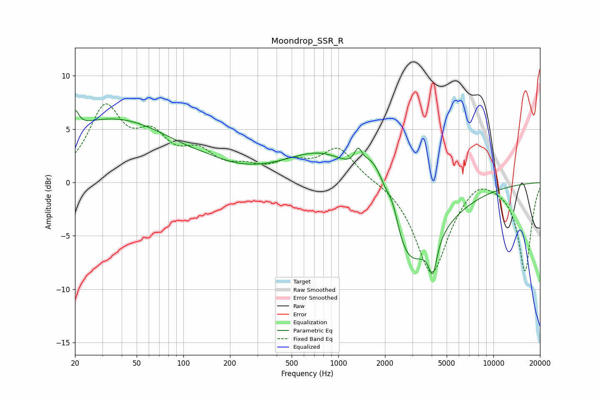

# Moondrop_SSR_R
See [usage instructions](https://github.com/jaakkopasanen/AutoEq#usage) for more options and info.

### Parametric EQs
Apply preamp of -6.8 dB when using parametric equalizer.

|   # | Type    |   Fc (Hz) |    Q |   Gain (dB) |
|-----|---------|-----------|------|-------------|
|   1 | Peaking |        20 | 6    |         1.7 |
|   2 | Peaking |        35 | 0.34 |         5.9 |
|   3 | Peaking |       146 | 1.21 |         0.3 |
|   4 | Peaking |       861 | 0.58 |         3.7 |
|   5 | Peaking |      1342 | 5.79 |         1.5 |
|   6 | Peaking |      1650 | 1.83 |         3.8 |
|   7 | Peaking |      1871 | 2.74 |         1.1 |
|   8 | Peaking |      2241 | 3.26 |         2.9 |
|   9 | Peaking |      2707 | 0.74 |        -9.2 |
|  10 | Peaking |      4071 | 5.4  |        -3.1 |

### Fixed Band EQs
When using fixed band (also called graphic) equalizer, apply preamp of **-7.5 dB** (if available) and set gains manually with these parameters.

|   # | Type    |   Fc (Hz) |    Q |   Gain (dB) |
|-----|---------|-----------|------|-------------|
|   1 | Peaking |        31 | 1.41 |         6.6 |
|   2 | Peaking |        62 | 1.41 |         3.5 |
|   3 | Peaking |       125 | 1.41 |         2.3 |
|   4 | Peaking |       250 | 1.41 |         1   |
|   5 | Peaking |       500 | 1.41 |         1.6 |
|   6 | Peaking |      1000 | 1.41 |         3.1 |
|   7 | Peaking |      2000 | 1.41 |         0.2 |
|   8 | Peaking |      4000 | 1.41 |        -8.6 |
|   9 | Peaking |      8000 | 1.41 |         1.1 |
|  10 | Peaking |     16000 | 1.41 |        -8.3 |

### Graphs

