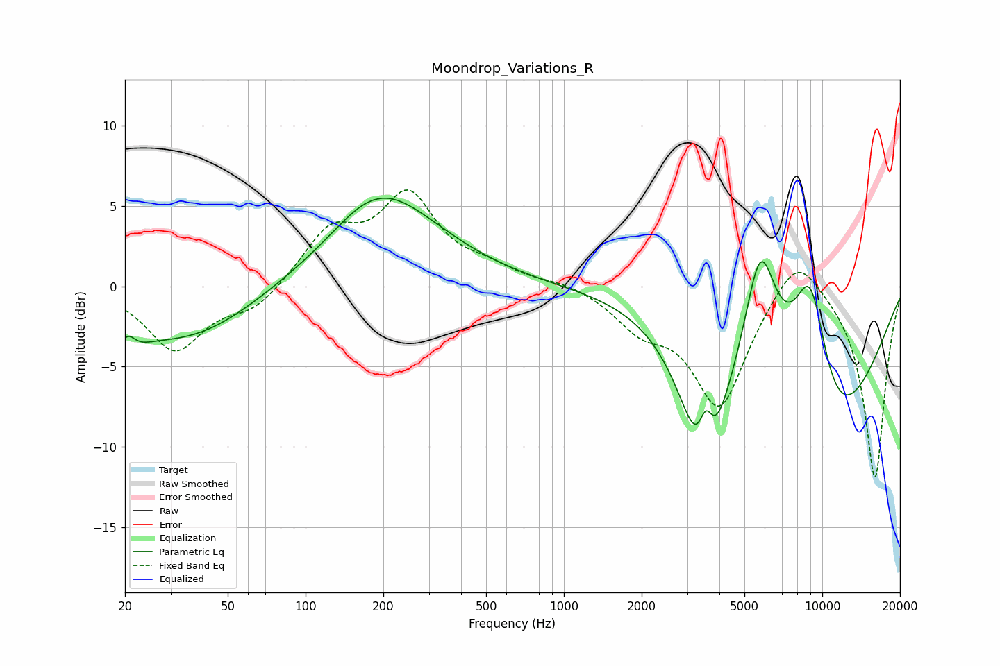

# Moondrop_Variations_R
See [usage instructions](https://github.com/jaakkopasanen/AutoEq#usage) for more options and info.

### Parametric EQs
Apply preamp of -5.6 dB when using parametric equalizer.

|   # | Type    |   Fc (Hz) |    Q |   Gain (dB) |
|-----|---------|-----------|------|-------------|
|   1 | Peaking |        20 | 2.51 |        -2.4 |
|   2 | Peaking |        21 | 4.54 |         1.7 |
|   3 | Peaking |        35 | 0.51 |        -3.4 |
|   4 | Peaking |       124 | 0.83 |        -1.2 |
|   5 | Peaking |       185 | 0.61 |         6.7 |
|   6 | Peaking |      3512 | 1.72 |       -10.6 |
|   7 | Peaking |      3542 | 4.65 |         4.2 |
|   8 | Peaking |      5756 | 2.16 |         7.9 |
|   9 | Peaking |      9017 | 1.47 |        11.6 |
|  10 | Peaking |     10000 | 0.57 |       -12.8 |

### Fixed Band EQs
When using fixed band (also called graphic) equalizer, apply preamp of **-6.1 dB** (if available) and set gains manually with these parameters.

|   # | Type    |   Fc (Hz) |    Q |   Gain (dB) |
|-----|---------|-----------|------|-------------|
|   1 | Peaking |        31 | 1.41 |        -3.9 |
|   2 | Peaking |        62 | 1.41 |        -1.4 |
|   3 | Peaking |       125 | 1.41 |         3.2 |
|   4 | Peaking |       250 | 1.41 |         5.3 |
|   5 | Peaking |       500 | 1.41 |         0.9 |
|   6 | Peaking |      1000 | 1.41 |         0.3 |
|   7 | Peaking |      2000 | 1.41 |        -2.2 |
|   8 | Peaking |      4000 | 1.41 |        -7.4 |
|   9 | Peaking |      8000 | 1.41 |         2.8 |
|  10 | Peaking |     16000 | 1.41 |       -12   |

### Graphs

