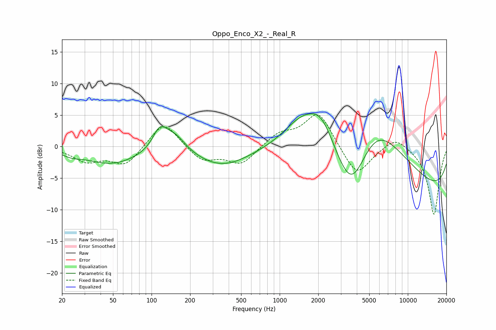

# Oppo_Enco_X2_-_Real_R
See [usage instructions](https://github.com/jaakkopasanen/AutoEq#usage) for more options and info.

### Parametric EQs
Apply preamp of -5.3 dB when using parametric equalizer.

|   # | Type    |   Fc (Hz) |    Q |   Gain (dB) |
|-----|---------|-----------|------|-------------|
|   1 | Peaking |        24 | 2.23 |        -0.6 |
|   2 | Peaking |        49 | 0.66 |        -2.7 |
|   3 | Peaking |       116 | 2.56 |         3.2 |
|   4 | Peaking |       151 | 1.59 |         2.8 |
|   5 | Peaking |       356 | 0.65 |        -3.1 |
|   6 | Peaking |      1483 | 0.98 |         4.3 |
|   7 | Peaking |      2124 | 1.33 |         5   |
|   8 | Peaking |      3636 | 0.99 |       -10.7 |
|   9 | Peaking |      5422 | 0.53 |        13.2 |
|  10 | Peaking |     10000 | 0.18 |        -8.4 |

### Fixed Band EQs
When using fixed band (also called graphic) equalizer, apply preamp of **-5.1 dB** (if available) and set gains manually with these parameters.

|   # | Type    |   Fc (Hz) |    Q |   Gain (dB) |
|-----|---------|-----------|------|-------------|
|   1 | Peaking |        31 | 1.41 |        -2.2 |
|   2 | Peaking |        62 | 1.41 |        -2.9 |
|   3 | Peaking |       125 | 1.41 |         4.2 |
|   4 | Peaking |       250 | 1.41 |        -2.3 |
|   5 | Peaking |       500 | 1.41 |        -2.8 |
|   6 | Peaking |      1000 | 1.41 |         2   |
|   7 | Peaking |      2000 | 1.41 |         5.6 |
|   8 | Peaking |      4000 | 1.41 |        -4.9 |
|   9 | Peaking |      8000 | 1.41 |         1.9 |
|  10 | Peaking |     16000 | 1.41 |       -10.8 |

### Graphs

