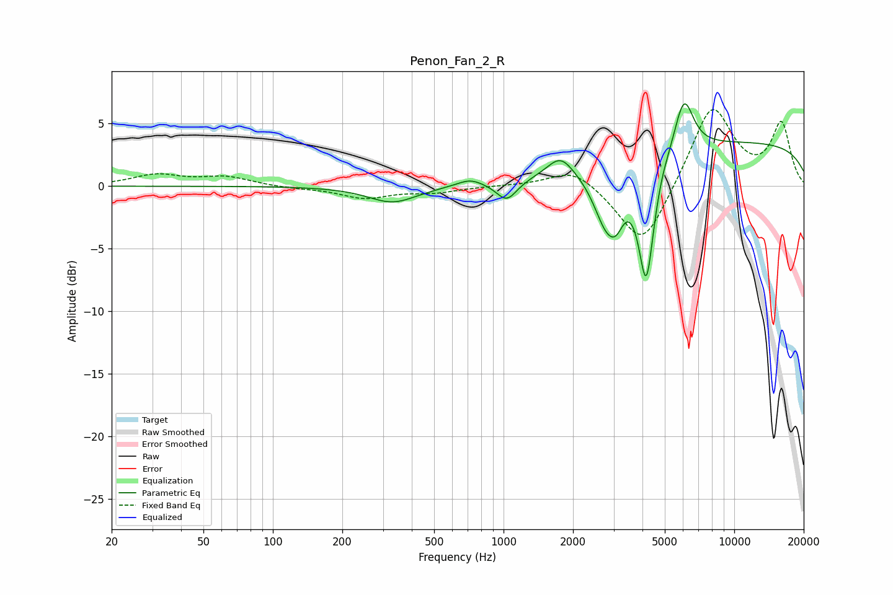

# Penon_Fan_2_R
See [usage instructions](https://github.com/jaakkopasanen/AutoEq#usage) for more options and info.

### Parametric EQs
Apply preamp of -6.7 dB when using parametric equalizer.

|   # | Type    |   Fc (Hz) |    Q |   Gain (dB) |
|-----|---------|-----------|------|-------------|
|   1 | Peaking |       330 | 1.34 |        -1.3 |
|   2 | Peaking |       714 | 2.59 |         0.6 |
|   3 | Peaking |      1032 | 3.11 |        -1.6 |
|   4 | Peaking |      1764 | 2.53 |         1.7 |
|   5 | Peaking |      2799 | 2.42 |        -4.5 |
|   6 | Peaking |      3088 | 4.32 |        -1.6 |
|   7 | Peaking |      4155 | 4.08 |        -9.6 |
|   8 | Peaking |      4832 | 5.59 |         0.2 |
|   9 | Peaking |      6050 | 3.32 |         4.3 |
|  10 | Peaking |     10000 | 0.18 |         3.5 |

### Fixed Band EQs
When using fixed band (also called graphic) equalizer, apply preamp of **-6.2 dB** (if available) and set gains manually with these parameters.

|   # | Type    |   Fc (Hz) |    Q |   Gain (dB) |
|-----|---------|-----------|------|-------------|
|   1 | Peaking |        31 | 1.41 |         0.9 |
|   2 | Peaking |        62 | 1.41 |         0.7 |
|   3 | Peaking |       125 | 1.41 |        -0.2 |
|   4 | Peaking |       250 | 1.41 |        -0.9 |
|   5 | Peaking |       500 | 1.41 |        -0.4 |
|   6 | Peaking |      1000 | 1.41 |         0   |
|   7 | Peaking |      2000 | 1.41 |         1.5 |
|   8 | Peaking |      4000 | 1.41 |        -5.1 |
|   9 | Peaking |      8000 | 1.41 |         6.6 |
|  10 | Peaking |     16000 | 1.41 |         4.9 |

### Graphs

