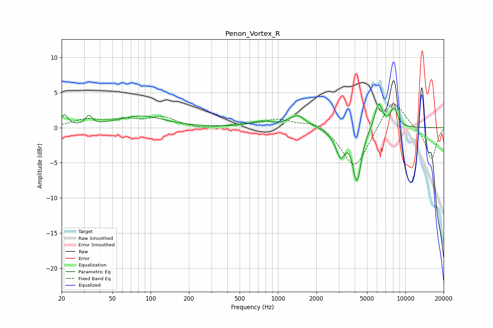

# Penon_Vortex_R
See [usage instructions](https://github.com/jaakkopasanen/AutoEq#usage) for more options and info.

### Parametric EQs
Apply preamp of -3.4 dB when using parametric equalizer.

|   # | Type    |   Fc (Hz) |    Q |   Gain (dB) |
|-----|---------|-----------|------|-------------|
|   1 | Peaking |        21 | 5.31 |         1.6 |
|   2 | Peaking |        33 | 5.71 |         1.3 |
|   3 | Peaking |        84 | 0.8  |         1.6 |
|   4 | Peaking |       740 | 1.55 |         0.8 |
|   5 | Peaking |      1424 | 2.3  |         1.7 |
|   6 | Peaking |      2664 | 3.5  |        -0.5 |
|   7 | Peaking |      3092 | 4.35 |        -3.4 |
|   8 | Peaking |      4175 | 4.22 |        -7.5 |
|   9 | Peaking |      6158 | 4.34 |         3.7 |
|  10 | Peaking |      8150 | 4.47 |         2.6 |

### Fixed Band EQs
When using fixed band (also called graphic) equalizer, apply preamp of **-3.4 dB** (if available) and set gains manually with these parameters.

|   # | Type    |   Fc (Hz) |    Q |   Gain (dB) |
|-----|---------|-----------|------|-------------|
|   1 | Peaking |        31 | 1.41 |         1.1 |
|   2 | Peaking |        62 | 1.41 |         1   |
|   3 | Peaking |       125 | 1.41 |         1.4 |
|   4 | Peaking |       250 | 1.41 |        -0.3 |
|   5 | Peaking |       500 | 1.41 |         0.4 |
|   6 | Peaking |      1000 | 1.41 |         1.1 |
|   7 | Peaking |      2000 | 1.41 |         1.1 |
|   8 | Peaking |      4000 | 1.41 |        -6   |
|   9 | Peaking |      8000 | 1.41 |         4.4 |
|  10 | Peaking |     16000 | 1.41 |        -4.6 |

### Graphs

