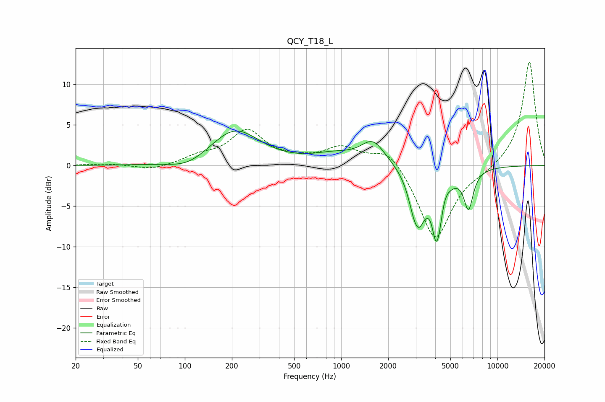

# QCY_T18_L
See [usage instructions](https://github.com/jaakkopasanen/AutoEq#usage) for more options and info.

### Parametric EQs
Apply preamp of -4.3 dB when using parametric equalizer.

|   # | Type    |   Fc (Hz) |    Q |   Gain (dB) |
|-----|---------|-----------|------|-------------|
|   1 | Peaking |       105 | 1.2  |        -1.1 |
|   2 | Peaking |       209 | 0.9  |         4.4 |
|   3 | Peaking |       902 | 0.99 |         1.1 |
|   4 | Peaking |      1599 | 1.84 |         2.8 |
|   5 | Peaking |      2978 | 3.3  |        -4.9 |
|   6 | Peaking |      3202 | 5.33 |        -1.6 |
|   7 | Peaking |      3777 | 6    |         1.5 |
|   8 | Peaking |      4080 | 3.2  |       -10.1 |
|   9 | Peaking |      4557 | 4.63 |         2   |
|  10 | Peaking |      6532 | 4.58 |        -4.6 |

### Fixed Band EQs
When using fixed band (also called graphic) equalizer, apply preamp of **-12.8 dB** (if available) and set gains manually with these parameters.

|   # | Type    |   Fc (Hz) |    Q |   Gain (dB) |
|-----|---------|-----------|------|-------------|
|   1 | Peaking |        31 | 1.41 |         0.2 |
|   2 | Peaking |        62 | 1.41 |        -0.6 |
|   3 | Peaking |       125 | 1.41 |         1   |
|   4 | Peaking |       250 | 1.41 |         4.1 |
|   5 | Peaking |       500 | 1.41 |         0.5 |
|   6 | Peaking |      1000 | 1.41 |         2.1 |
|   7 | Peaking |      2000 | 1.41 |         2.4 |
|   8 | Peaking |      4000 | 1.41 |        -9.4 |
|   9 | Peaking |      8000 | 1.41 |        -0.6 |
|  10 | Peaking |     16000 | 1.41 |        12.9 |

### Graphs

