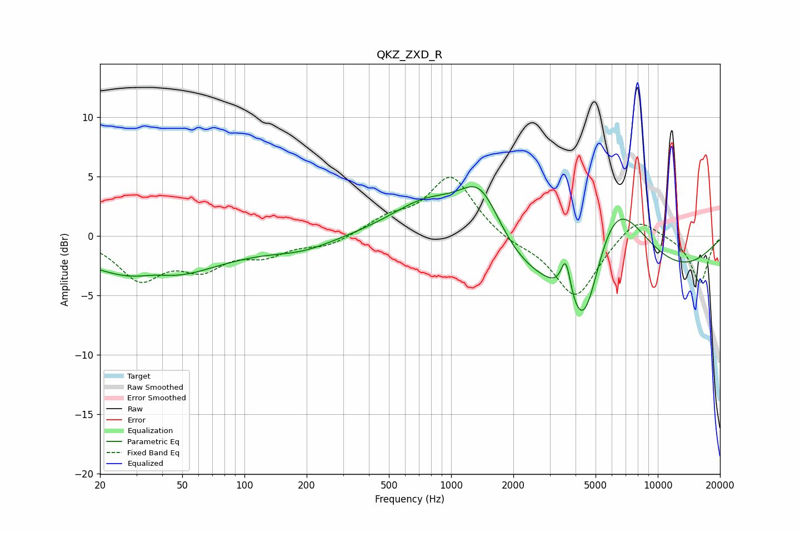

# QKZ_ZXD_R
See [usage instructions](https://github.com/jaakkopasanen/AutoEq#usage) for more options and info.

### Parametric EQs
Apply preamp of -4.2 dB when using parametric equalizer.

|   # | Type    |   Fc (Hz) |    Q |   Gain (dB) |
|-----|---------|-----------|------|-------------|
|   1 | Peaking |        30 | 0.18 |        -1.1 |
|   2 | Peaking |        36 | 0.6  |        -3.1 |
|   3 | Peaking |        37 | 1.42 |         0.9 |
|   4 | Peaking |       192 | 0.98 |        -0.8 |
|   5 | Peaking |       787 | 0.7  |         5.1 |
|   6 | Peaking |      1388 | 1.25 |         6.1 |
|   7 | Peaking |      3588 | 5.96 |         3.2 |
|   8 | Peaking |      4084 | 0.19 |        -7.7 |
|   9 | Peaking |      4384 | 1.66 |        -8.1 |
|  10 | Peaking |      6045 | 0.75 |        11.1 |

### Fixed Band EQs
When using fixed band (also called graphic) equalizer, apply preamp of **-5.0 dB** (if available) and set gains manually with these parameters.

|   # | Type    |   Fc (Hz) |    Q |   Gain (dB) |
|-----|---------|-----------|------|-------------|
|   1 | Peaking |        31 | 1.41 |        -3.4 |
|   2 | Peaking |        62 | 1.41 |        -2.3 |
|   3 | Peaking |       125 | 1.41 |        -1.4 |
|   4 | Peaking |       250 | 1.41 |        -0.8 |
|   5 | Peaking |       500 | 1.41 |         1.3 |
|   6 | Peaking |      1000 | 1.41 |         5   |
|   7 | Peaking |      2000 | 1.41 |        -0.6 |
|   8 | Peaking |      4000 | 1.41 |        -5.2 |
|   9 | Peaking |      8000 | 1.41 |         1.9 |
|  10 | Peaking |     16000 | 1.41 |        -4   |

### Graphs

