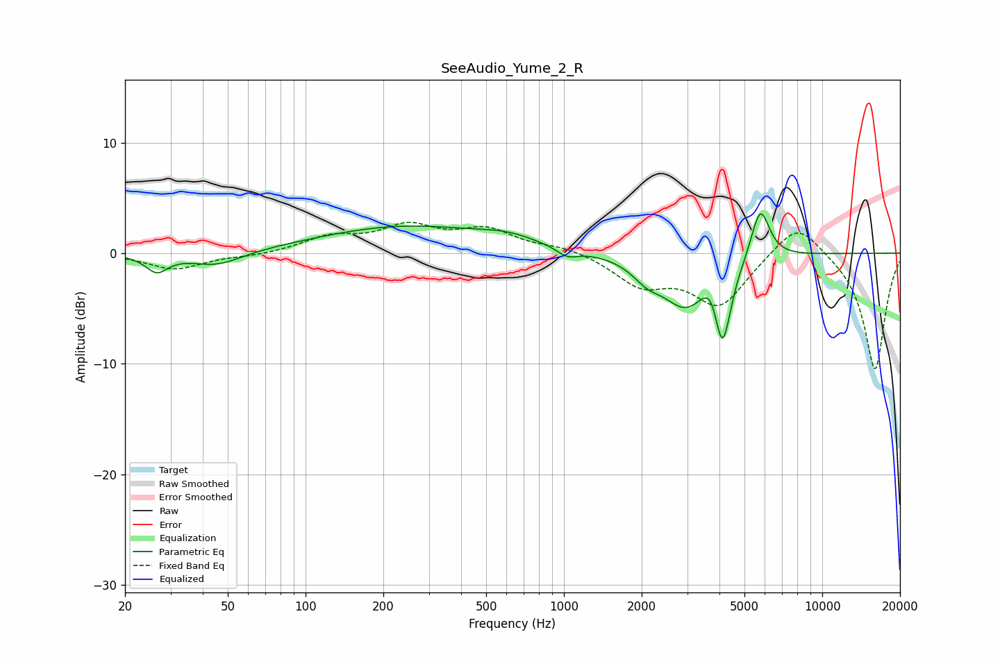

# SeeAudio_Yume_2_R
See [usage instructions](https://github.com/jaakkopasanen/AutoEq#usage) for more options and info.

### Parametric EQs
Apply preamp of -3.7 dB when using parametric equalizer.

|   # | Type    |   Fc (Hz) |    Q |   Gain (dB) |
|-----|---------|-----------|------|-------------|
|   1 | Peaking |        27 | 3.35 |        -1.6 |
|   2 | Peaking |        45 | 1.4  |        -1.3 |
|   3 | Peaking |       242 | 0.43 |         2.4 |
|   4 | Peaking |       608 | 1.26 |         0.8 |
|   5 | Peaking |      1031 | 3.48 |        -0.8 |
|   6 | Peaking |      2102 | 2.44 |        -1.4 |
|   7 | Peaking |      2953 | 1.59 |        -4.4 |
|   8 | Peaking |      3736 | 3.94 |         2.1 |
|   9 | Peaking |      4108 | 4.3  |        -7.5 |
|  10 | Peaking |      5755 | 3.85 |         4.8 |

### Fixed Band EQs
When using fixed band (also called graphic) equalizer, apply preamp of **-2.9 dB** (if available) and set gains manually with these parameters.

|   # | Type    |   Fc (Hz) |    Q |   Gain (dB) |
|-----|---------|-----------|------|-------------|
|   1 | Peaking |        31 | 1.41 |        -1.4 |
|   2 | Peaking |        62 | 1.41 |        -0.2 |
|   3 | Peaking |       125 | 1.41 |         1.3 |
|   4 | Peaking |       250 | 1.41 |         2.2 |
|   5 | Peaking |       500 | 1.41 |         2   |
|   6 | Peaking |      1000 | 1.41 |         0.6 |
|   7 | Peaking |      2000 | 1.41 |        -2.7 |
|   8 | Peaking |      4000 | 1.41 |        -4.6 |
|   9 | Peaking |      8000 | 1.41 |         3.2 |
|  10 | Peaking |     16000 | 1.41 |       -10.6 |

### Graphs

