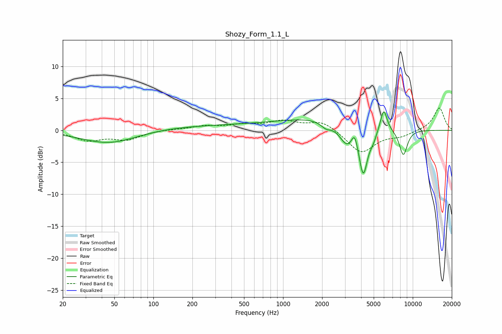

# Shozy_Form_1.1_L
See [usage instructions](https://github.com/jaakkopasanen/AutoEq#usage) for more options and info.

### Parametric EQs
Apply preamp of -3.0 dB when using parametric equalizer.

|   # | Type    |   Fc (Hz) |    Q |   Gain (dB) |
|-----|---------|-----------|------|-------------|
|   1 | Peaking |        46 | 0.66 |        -2.1 |
|   2 | Peaking |       313 | 0.23 |         0.8 |
|   3 | Peaking |      2064 | 0.46 |         1.7 |
|   4 | Peaking |      2143 | 3.53 |        -0.9 |
|   5 | Peaking |      3107 | 2.38 |        -3.1 |
|   6 | Peaking |      3562 | 6    |         2.2 |
|   7 | Peaking |      4155 | 4.15 |        -7.2 |
|   8 | Peaking |      4952 | 5.46 |        -1.1 |
|   9 | Peaking |      5975 | 5.37 |         3.5 |
|  10 | Peaking |      8460 | 4.09 |        -4.1 |

### Fixed Band EQs
When using fixed band (also called graphic) equalizer, apply preamp of **-3.6 dB** (if available) and set gains manually with these parameters.

|   # | Type    |   Fc (Hz) |    Q |   Gain (dB) |
|-----|---------|-----------|------|-------------|
|   1 | Peaking |        31 | 1.41 |        -1.5 |
|   2 | Peaking |        62 | 1.41 |        -1.3 |
|   3 | Peaking |       125 | 1.41 |         0.1 |
|   4 | Peaking |       250 | 1.41 |         0.6 |
|   5 | Peaking |       500 | 1.41 |         0.8 |
|   6 | Peaking |      1000 | 1.41 |         1.3 |
|   7 | Peaking |      2000 | 1.41 |         1.5 |
|   8 | Peaking |      4000 | 1.41 |        -3.5 |
|   9 | Peaking |      8000 | 1.41 |        -0.8 |
|  10 | Peaking |     16000 | 1.41 |         3.6 |

### Graphs

