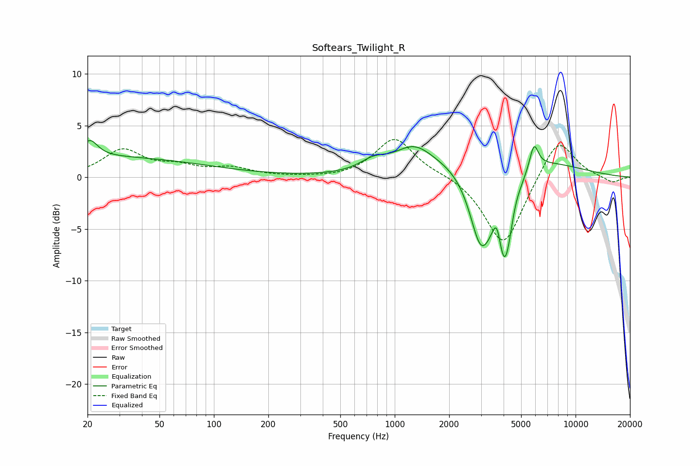

# Softears_Twilight_R
See [usage instructions](https://github.com/jaakkopasanen/AutoEq#usage) for more options and info.

### Parametric EQs
Apply preamp of -3.6 dB when using parametric equalizer.

|   # | Type    |   Fc (Hz) |    Q |   Gain (dB) |
|-----|---------|-----------|------|-------------|
|   1 | Peaking |        21 | 3.43 |         1.6 |
|   2 | Peaking |        21 | 0.21 |         2   |
|   3 | Peaking |       761 | 1.91 |         1   |
|   4 | Peaking |      1274 | 1.34 |         2.3 |
|   5 | Peaking |      2995 | 2.15 |        -7.6 |
|   6 | Peaking |      3674 | 5.97 |         2.8 |
|   7 | Peaking |      4002 | 0.47 |         3.1 |
|   8 | Peaking |      4059 | 2.79 |        -9.7 |
|   9 | Peaking |      4611 | 4.87 |         0.9 |
|  10 | Peaking |      5890 | 5.7  |         2.5 |

### Fixed Band EQs
When using fixed band (also called graphic) equalizer, apply preamp of **-3.7 dB** (if available) and set gains manually with these parameters.

|   # | Type    |   Fc (Hz) |    Q |   Gain (dB) |
|-----|---------|-----------|------|-------------|
|   1 | Peaking |        31 | 1.41 |         2.6 |
|   2 | Peaking |        62 | 1.41 |         0.9 |
|   3 | Peaking |       125 | 1.41 |         0.8 |
|   4 | Peaking |       250 | 1.41 |        -0   |
|   5 | Peaking |       500 | 1.41 |        -0.1 |
|   6 | Peaking |      1000 | 1.41 |         3.8 |
|   7 | Peaking |      2000 | 1.41 |         0.3 |
|   8 | Peaking |      4000 | 1.41 |        -6.8 |
|   9 | Peaking |      8000 | 1.41 |         4.1 |
|  10 | Peaking |     16000 | 1.41 |        -0.6 |

### Graphs

