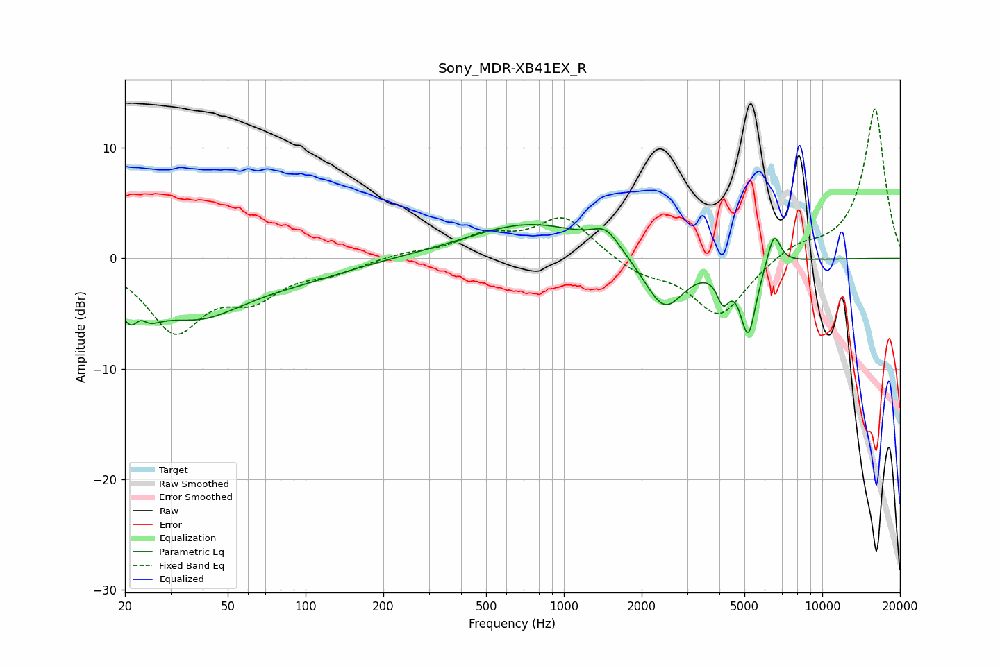

# Sony_MDR-XB41EX_R
See [usage instructions](https://github.com/jaakkopasanen/AutoEq#usage) for more options and info.

### Parametric EQs
Apply preamp of -3.2 dB when using parametric equalizer.

|   # | Type    |   Fc (Hz) |    Q |   Gain (dB) |
|-----|---------|-----------|------|-------------|
|   1 | Peaking |        22 | 2.65 |        -5.7 |
|   2 | Peaking |        23 | 4.71 |         3   |
|   3 | Peaking |        38 | 0.72 |        -4.8 |
|   4 | Peaking |        98 | 0.7  |        -1.1 |
|   5 | Peaking |       745 | 0.58 |         3.2 |
|   6 | Peaking |      1457 | 2.68 |         1.8 |
|   7 | Peaking |      2448 | 1.79 |        -5   |
|   8 | Peaking |      4132 | 5.95 |        -2.6 |
|   9 | Peaking |      5170 | 4.45 |        -6.5 |
|  10 | Peaking |      6501 | 5.4  |         3.1 |

### Fixed Band EQs
When using fixed band (also called graphic) equalizer, apply preamp of **-13.6 dB** (if available) and set gains manually with these parameters.

|   # | Type    |   Fc (Hz) |    Q |   Gain (dB) |
|-----|---------|-----------|------|-------------|
|   1 | Peaking |        31 | 1.41 |        -6.3 |
|   2 | Peaking |        62 | 1.41 |        -3   |
|   3 | Peaking |       125 | 1.41 |        -1.1 |
|   4 | Peaking |       250 | 1.41 |         0.5 |
|   5 | Peaking |       500 | 1.41 |         1.9 |
|   6 | Peaking |      1000 | 1.41 |         3.7 |
|   7 | Peaking |      2000 | 1.41 |        -1.3 |
|   8 | Peaking |      4000 | 1.41 |        -5.2 |
|   9 | Peaking |      8000 | 1.41 |         1.2 |
|  10 | Peaking |     16000 | 1.41 |        13.6 |

### Graphs

