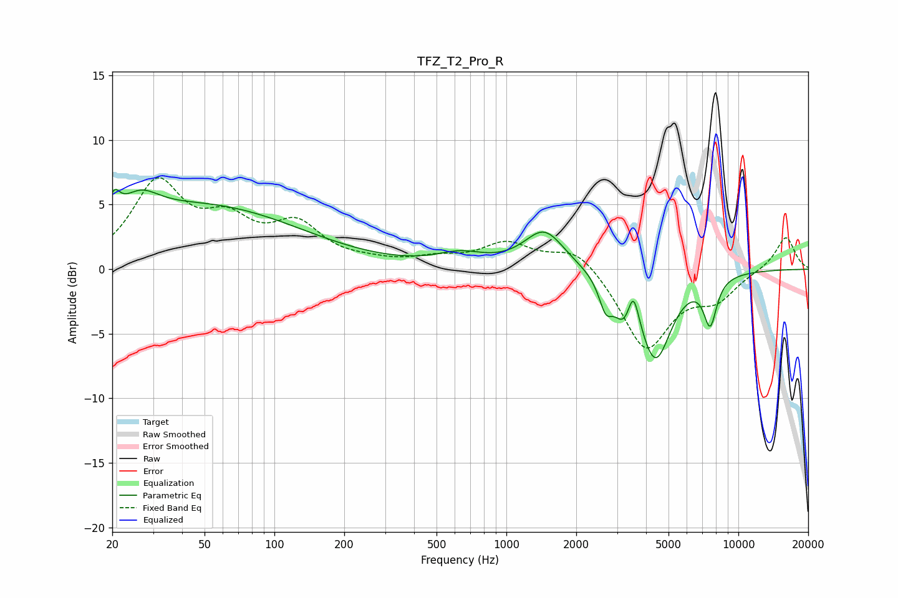

# TFZ_T2_Pro_R
See [usage instructions](https://github.com/jaakkopasanen/AutoEq#usage) for more options and info.

### Parametric EQs
Apply preamp of -6.3 dB when using parametric equalizer.

|   # | Type    |   Fc (Hz) |    Q |   Gain (dB) |
|-----|---------|-----------|------|-------------|
|   1 | Peaking |        20 | 5.78 |         1.7 |
|   2 | Peaking |        26 | 1.72 |         2   |
|   3 | Peaking |        50 | 0.34 |         4.8 |
|   4 | Peaking |       633 | 1.4  |         0.9 |
|   5 | Peaking |      1458 | 1.64 |         3   |
|   6 | Peaking |      2680 | 4.88 |        -2.1 |
|   7 | Peaking |      3203 | 3.39 |        -2.3 |
|   8 | Peaking |      3527 | 5.99 |         2.7 |
|   9 | Peaking |      4390 | 2.02 |        -6.8 |
|  10 | Peaking |      7559 | 4.77 |        -3.5 |

### Fixed Band EQs
When using fixed band (also called graphic) equalizer, apply preamp of **-7.2 dB** (if available) and set gains manually with these parameters.

|   # | Type    |   Fc (Hz) |    Q |   Gain (dB) |
|-----|---------|-----------|------|-------------|
|   1 | Peaking |        31 | 1.41 |         6.4 |
|   2 | Peaking |        62 | 1.41 |         3   |
|   3 | Peaking |       125 | 1.41 |         3.1 |
|   4 | Peaking |       250 | 1.41 |         0.4 |
|   5 | Peaking |       500 | 1.41 |         0.6 |
|   6 | Peaking |      1000 | 1.41 |         1.9 |
|   7 | Peaking |      2000 | 1.41 |         1.8 |
|   8 | Peaking |      4000 | 1.41 |        -6.2 |
|   9 | Peaking |      8000 | 1.41 |        -2   |
|  10 | Peaking |     16000 | 1.41 |         2.6 |

### Graphs

