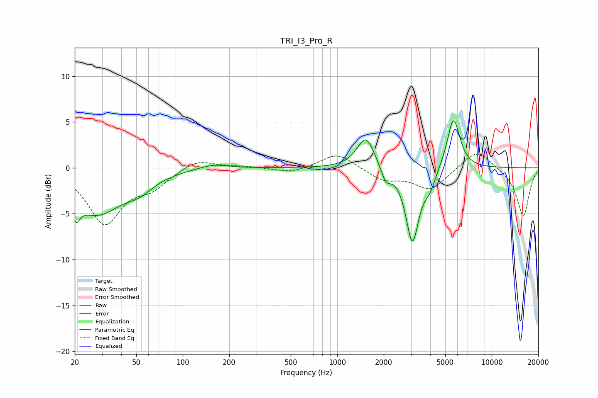

# TRI_I3_Pro_R
See [usage instructions](https://github.com/jaakkopasanen/AutoEq#usage) for more options and info.

### Parametric EQs
Apply preamp of -5.2 dB when using parametric equalizer.

|   # | Type    |   Fc (Hz) |    Q |   Gain (dB) |
|-----|---------|-----------|------|-------------|
|   1 | Peaking |        20 | 5.91 |         3.2 |
|   2 | Peaking |        20 | 5.89 |        -5.3 |
|   3 | Peaking |        28 | 0.85 |        -4.8 |
|   4 | Peaking |        53 | 1.61 |        -1.2 |
|   5 | Peaking |       157 | 1.46 |         0.5 |
|   6 | Peaking |      1536 | 2.45 |         3.5 |
|   7 | Peaking |      2066 | 4.35 |        -1.6 |
|   8 | Peaking |      3068 | 3.32 |        -8.1 |
|   9 | Peaking |      3981 | 3.75 |        -1.6 |
|  10 | Peaking |      5657 | 3.39 |         5.7 |

### Fixed Band EQs
When using fixed band (also called graphic) equalizer, apply preamp of **-1.6 dB** (if available) and set gains manually with these parameters.

|   # | Type    |   Fc (Hz) |    Q |   Gain (dB) |
|-----|---------|-----------|------|-------------|
|   1 | Peaking |        31 | 1.41 |        -5.9 |
|   2 | Peaking |        62 | 1.41 |        -1.8 |
|   3 | Peaking |       125 | 1.41 |         1   |
|   4 | Peaking |       250 | 1.41 |         0.2 |
|   5 | Peaking |       500 | 1.41 |        -0.6 |
|   6 | Peaking |      1000 | 1.41 |         1.7 |
|   7 | Peaking |      2000 | 1.41 |        -1.3 |
|   8 | Peaking |      4000 | 1.41 |        -2.3 |
|   9 | Peaking |      8000 | 1.41 |         2.1 |
|  10 | Peaking |     16000 | 1.41 |        -5.3 |

### Graphs

