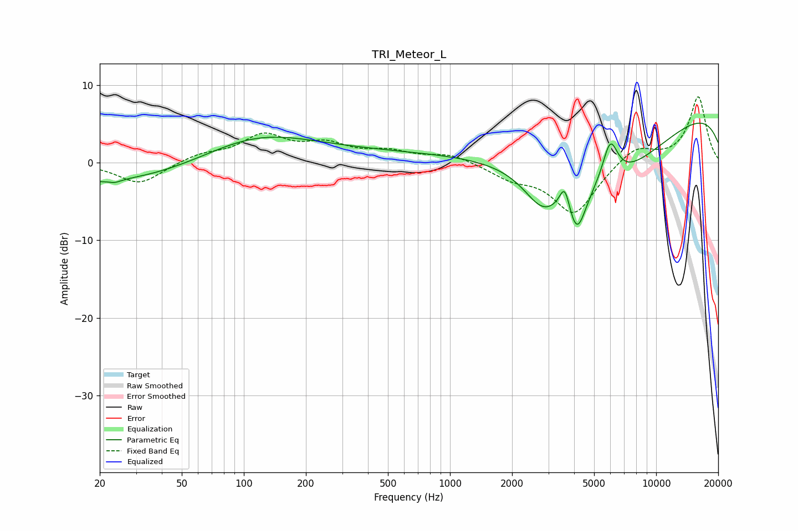

# TRI_Meteor_L
See [usage instructions](https://github.com/jaakkopasanen/AutoEq#usage) for more options and info.

### Parametric EQs
Apply preamp of -5.2 dB when using parametric equalizer.

|   # | Type    |   Fc (Hz) |    Q |   Gain (dB) |
|-----|---------|-----------|------|-------------|
|   1 | Peaking |        22 | 0.27 |        -2.8 |
|   2 | Peaking |        24 | 5.02 |        -0.3 |
|   3 | Peaking |       110 | 0.52 |         3.5 |
|   4 | Peaking |       418 | 0.3  |         1.2 |
|   5 | Peaking |      2814 | 1.54 |        -4.5 |
|   6 | Peaking |      3604 | 5.64 |         3.4 |
|   7 | Peaking |      4125 | 3.17 |        -5.8 |
|   8 | Peaking |      5543 | 0.44 |        -9.3 |
|   9 | Peaking |      5986 | 3.63 |         5.3 |
|  10 | Peaking |      9968 | 0.18 |         8   |

### Fixed Band EQs
When using fixed band (also called graphic) equalizer, apply preamp of **-8.6 dB** (if available) and set gains manually with these parameters.

|   # | Type    |   Fc (Hz) |    Q |   Gain (dB) |
|-----|---------|-----------|------|-------------|
|   1 | Peaking |        31 | 1.41 |        -2.8 |
|   2 | Peaking |        62 | 1.41 |         1   |
|   3 | Peaking |       125 | 1.41 |         3.3 |
|   4 | Peaking |       250 | 1.41 |         2   |
|   5 | Peaking |       500 | 1.41 |         1.2 |
|   6 | Peaking |      1000 | 1.41 |         1.1 |
|   7 | Peaking |      2000 | 1.41 |        -1.7 |
|   8 | Peaking |      4000 | 1.41 |        -6.6 |
|   9 | Peaking |      8000 | 1.41 |         2.2 |
|  10 | Peaking |     16000 | 1.41 |         8.5 |

### Graphs

