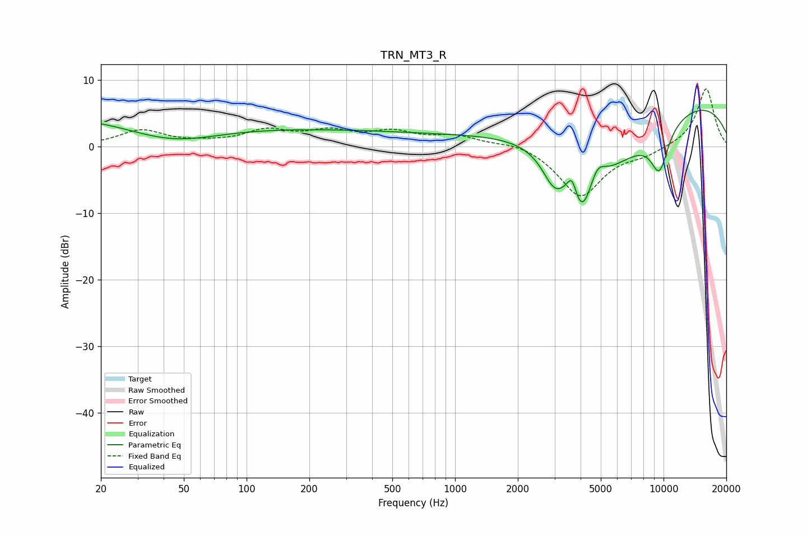

# TRN_MT3_R
See [usage instructions](https://github.com/jaakkopasanen/AutoEq#usage) for more options and info.

### Parametric EQs
Apply preamp of -5.5 dB when using parametric equalizer.

|   # | Type    |   Fc (Hz) |    Q |   Gain (dB) |
|-----|---------|-----------|------|-------------|
|   1 | Peaking |        20 | 0.24 |         5.1 |
|   2 | Peaking |        43 | 0.59 |        -3.8 |
|   3 | Peaking |       253 | 0.28 |         2.2 |
|   4 | Peaking |      2993 | 2.44 |        -4.7 |
|   5 | Peaking |      3640 | 5.95 |         3.1 |
|   6 | Peaking |      4050 | 2.59 |        -7.6 |
|   7 | Peaking |      4808 | 3.75 |         2.7 |
|   8 | Peaking |      5320 | 0.52 |       -10.4 |
|   9 | Peaking |      8498 | 0.19 |         9.3 |
|  10 | Peaking |      9561 | 2.85 |        -6.4 |

### Fixed Band EQs
When using fixed band (also called graphic) equalizer, apply preamp of **-8.7 dB** (if available) and set gains manually with these parameters.

|   # | Type    |   Fc (Hz) |    Q |   Gain (dB) |
|-----|---------|-----------|------|-------------|
|   1 | Peaking |        31 | 1.41 |         2.3 |
|   2 | Peaking |        62 | 1.41 |         0.3 |
|   3 | Peaking |       125 | 1.41 |         2.2 |
|   4 | Peaking |       250 | 1.41 |         1.9 |
|   5 | Peaking |       500 | 1.41 |         1.9 |
|   6 | Peaking |      1000 | 1.41 |         1.5 |
|   7 | Peaking |      2000 | 1.41 |         0.8 |
|   8 | Peaking |      4000 | 1.41 |        -7.6 |
|   9 | Peaking |      8000 | 1.41 |        -1.1 |
|  10 | Peaking |     16000 | 1.41 |         8.8 |

### Graphs

