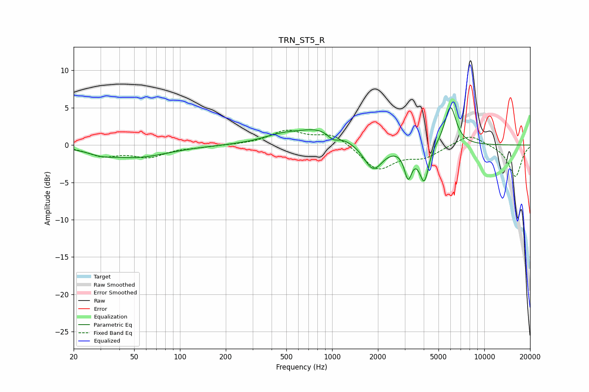

# TRN_ST5_R
See [usage instructions](https://github.com/jaakkopasanen/AutoEq#usage) for more options and info.

### Parametric EQs
Apply preamp of -5.1 dB when using parametric equalizer.

|   # | Type    |   Fc (Hz) |    Q |   Gain (dB) |
|-----|---------|-----------|------|-------------|
|   1 | Peaking |        30 | 1.84 |        -0.5 |
|   2 | Peaking |        51 | 0.68 |        -1.6 |
|   3 | Peaking |       465 | 1.1  |         0.9 |
|   4 | Peaking |       865 | 0.92 |         2.1 |
|   5 | Peaking |      1015 | 3.74 |        -1   |
|   6 | Peaking |      1859 | 2.27 |        -3.6 |
|   7 | Peaking |      3158 | 5.74 |        -3.7 |
|   8 | Peaking |      4043 | 4.32 |        -5.2 |
|   9 | Peaking |      4384 | 4.04 |         0.6 |
|  10 | Peaking |      5985 | 3.62 |         5.4 |

### Fixed Band EQs
When using fixed band (also called graphic) equalizer, apply preamp of **-2.1 dB** (if available) and set gains manually with these parameters.

|   # | Type    |   Fc (Hz) |    Q |   Gain (dB) |
|-----|---------|-----------|------|-------------|
|   1 | Peaking |        31 | 1.41 |        -1.3 |
|   2 | Peaking |        62 | 1.41 |        -1.5 |
|   3 | Peaking |       125 | 1.41 |        -0.2 |
|   4 | Peaking |       250 | 1.41 |         0   |
|   5 | Peaking |       500 | 1.41 |         1.8 |
|   6 | Peaking |      1000 | 1.41 |         1.6 |
|   7 | Peaking |      2000 | 1.41 |        -3.3 |
|   8 | Peaking |      4000 | 1.41 |        -1.5 |
|   9 | Peaking |      8000 | 1.41 |         1.6 |
|  10 | Peaking |     16000 | 1.41 |        -4.3 |

### Graphs

