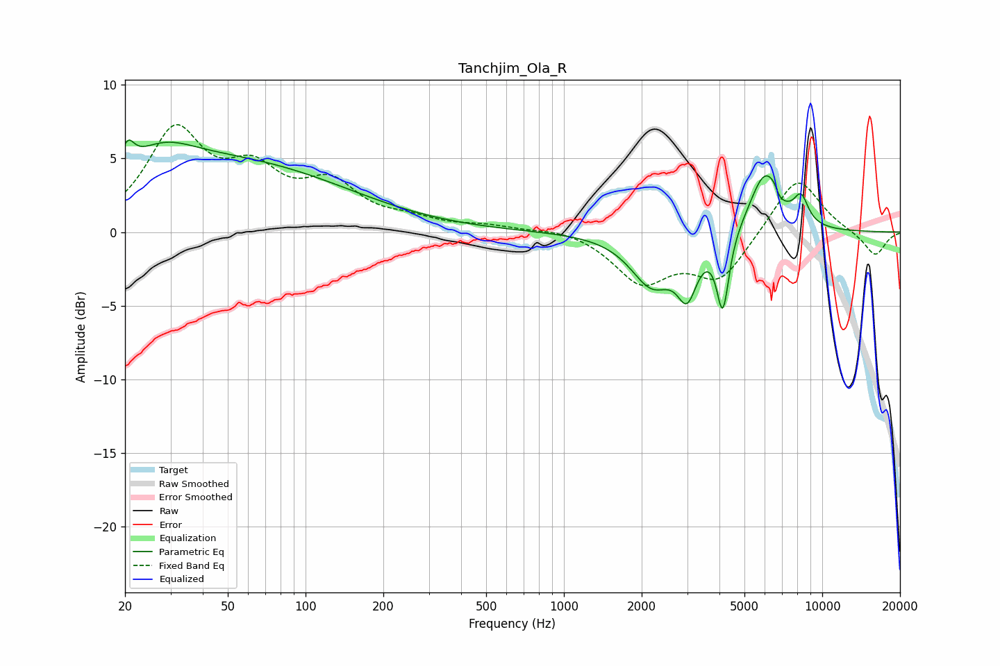

# Tanchjim_Ola_R
See [usage instructions](https://github.com/jaakkopasanen/AutoEq#usage) for more options and info.

### Parametric EQs
Apply preamp of -6.3 dB when using parametric equalizer.

|   # | Type    |   Fc (Hz) |    Q |   Gain (dB) |
|-----|---------|-----------|------|-------------|
|   1 | Peaking |        20 | 5.8  |         1.6 |
|   2 | Peaking |        27 | 1.09 |         2.1 |
|   3 | Peaking |        52 | 0.31 |         4.6 |
|   4 | Peaking |      2196 | 1.69 |        -3.5 |
|   5 | Peaking |      3001 | 3.71 |        -3.3 |
|   6 | Peaking |      4124 | 6    |        -5.1 |
|   7 | Peaking |      6009 | 2.26 |         4.2 |
|   8 | Peaking |      6638 | 5.98 |         2.6 |
|   9 | Peaking |      6693 | 5.76 |        -2.9 |
|  10 | Peaking |      8281 | 4.67 |         1.8 |

### Fixed Band EQs
When using fixed band (also called graphic) equalizer, apply preamp of **-7.4 dB** (if available) and set gains manually with these parameters.

|   # | Type    |   Fc (Hz) |    Q |   Gain (dB) |
|-----|---------|-----------|------|-------------|
|   1 | Peaking |        31 | 1.41 |         6.5 |
|   2 | Peaking |        62 | 1.41 |         3.4 |
|   3 | Peaking |       125 | 1.41 |         2.9 |
|   4 | Peaking |       250 | 1.41 |         0.6 |
|   5 | Peaking |       500 | 1.41 |         0.4 |
|   6 | Peaking |      1000 | 1.41 |         0.3 |
|   7 | Peaking |      2000 | 1.41 |        -3.3 |
|   8 | Peaking |      4000 | 1.41 |        -3.1 |
|   9 | Peaking |      8000 | 1.41 |         3.9 |
|  10 | Peaking |     16000 | 1.41 |        -1.7 |

### Graphs

