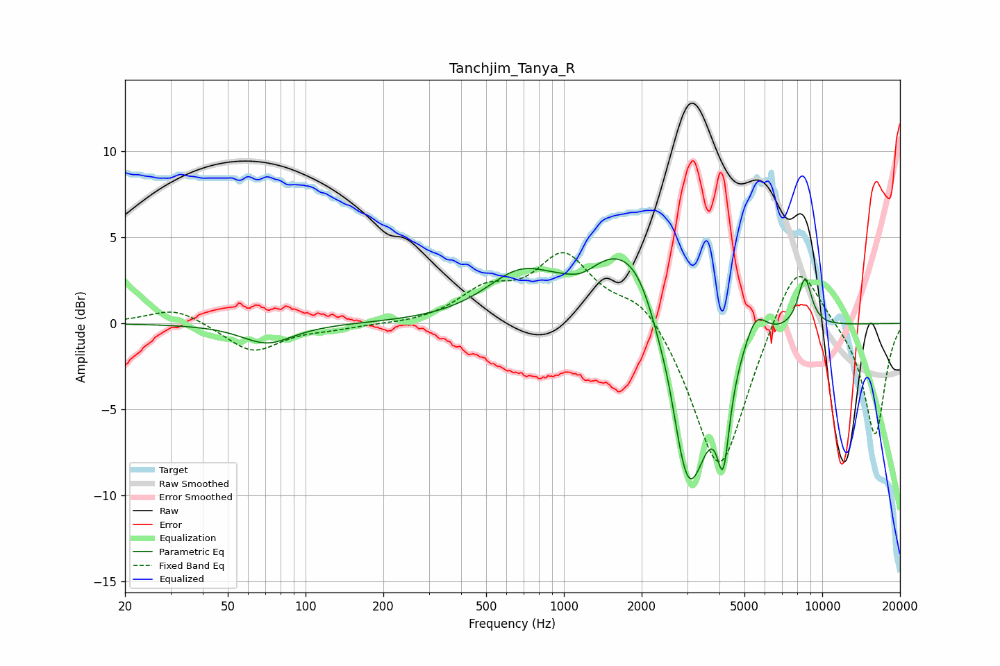

# Tanchjim_Tanya_R
See [usage instructions](https://github.com/jaakkopasanen/AutoEq#usage) for more options and info.

### Parametric EQs
Apply preamp of -3.8 dB when using parametric equalizer.

|   # | Type    |   Fc (Hz) |    Q |   Gain (dB) |
|-----|---------|-----------|------|-------------|
|   1 | Peaking |        71 | 1.42 |        -1.2 |
|   2 | Peaking |       671 | 1.06 |         2.4 |
|   3 | Peaking |      1178 | 2.23 |        -0.6 |
|   4 | Peaking |      1593 | 0.91 |         4.1 |
|   5 | Peaking |      2006 | 1.62 |         2.3 |
|   6 | Peaking |      2567 | 3.62 |         1.1 |
|   7 | Peaking |      3020 | 1.65 |       -11.6 |
|   8 | Peaking |      4140 | 6    |        -4.8 |
|   9 | Peaking |      5518 | 3.13 |         1.9 |
|  10 | Peaking |      8563 | 4.75 |         2.9 |

### Fixed Band EQs
When using fixed band (also called graphic) equalizer, apply preamp of **-4.2 dB** (if available) and set gains manually with these parameters.

|   # | Type    |   Fc (Hz) |    Q |   Gain (dB) |
|-----|---------|-----------|------|-------------|
|   1 | Peaking |        31 | 1.41 |         0.9 |
|   2 | Peaking |        62 | 1.41 |        -1.7 |
|   3 | Peaking |       125 | 1.41 |        -0.2 |
|   4 | Peaking |       250 | 1.41 |        -0.1 |
|   5 | Peaking |       500 | 1.41 |         1.7 |
|   6 | Peaking |      1000 | 1.41 |         3.8 |
|   7 | Peaking |      2000 | 1.41 |         1.7 |
|   8 | Peaking |      4000 | 1.41 |        -9   |
|   9 | Peaking |      8000 | 1.41 |         4.4 |
|  10 | Peaking |     16000 | 1.41 |        -6.6 |

### Graphs

