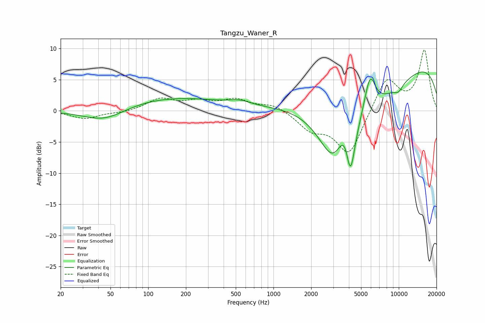

# Tangzu_Waner_R
See [usage instructions](https://github.com/jaakkopasanen/AutoEq#usage) for more options and info.

### Parametric EQs
Apply preamp of -6.3 dB when using parametric equalizer.

|   # | Type    |   Fc (Hz) |    Q |   Gain (dB) |
|-----|---------|-----------|------|-------------|
|   1 | Peaking |        45 | 0.8  |        -2.4 |
|   2 | Peaking |       140 | 0.3  |         2.2 |
|   3 | Peaking |       539 | 1.69 |         0.6 |
|   4 | Peaking |      3040 | 1.13 |        -9.5 |
|   5 | Peaking |      3784 | 2.32 |         6.4 |
|   6 | Peaking |      4105 | 3.39 |       -10.7 |
|   7 | Peaking |      5888 | 3.07 |         5.9 |
|   8 | Peaking |      6177 | 0.36 |        -8.8 |
|   9 | Peaking |      9141 | 0.2  |        11.6 |
|  10 | Peaking |      9924 | 3.65 |        -1   |

### Fixed Band EQs
When using fixed band (also called graphic) equalizer, apply preamp of **-9.9 dB** (if available) and set gains manually with these parameters.

|   # | Type    |   Fc (Hz) |    Q |   Gain (dB) |
|-----|---------|-----------|------|-------------|
|   1 | Peaking |        31 | 1.41 |        -1.2 |
|   2 | Peaking |        62 | 1.41 |        -0.3 |
|   3 | Peaking |       125 | 1.41 |         1.8 |
|   4 | Peaking |       250 | 1.41 |         1.3 |
|   5 | Peaking |       500 | 1.41 |         1.7 |
|   6 | Peaking |      1000 | 1.41 |         1.1 |
|   7 | Peaking |      2000 | 1.41 |        -2.7 |
|   8 | Peaking |      4000 | 1.41 |        -7   |
|   9 | Peaking |      8000 | 1.41 |         5.5 |
|  10 | Peaking |     16000 | 1.41 |         9.6 |

### Graphs

