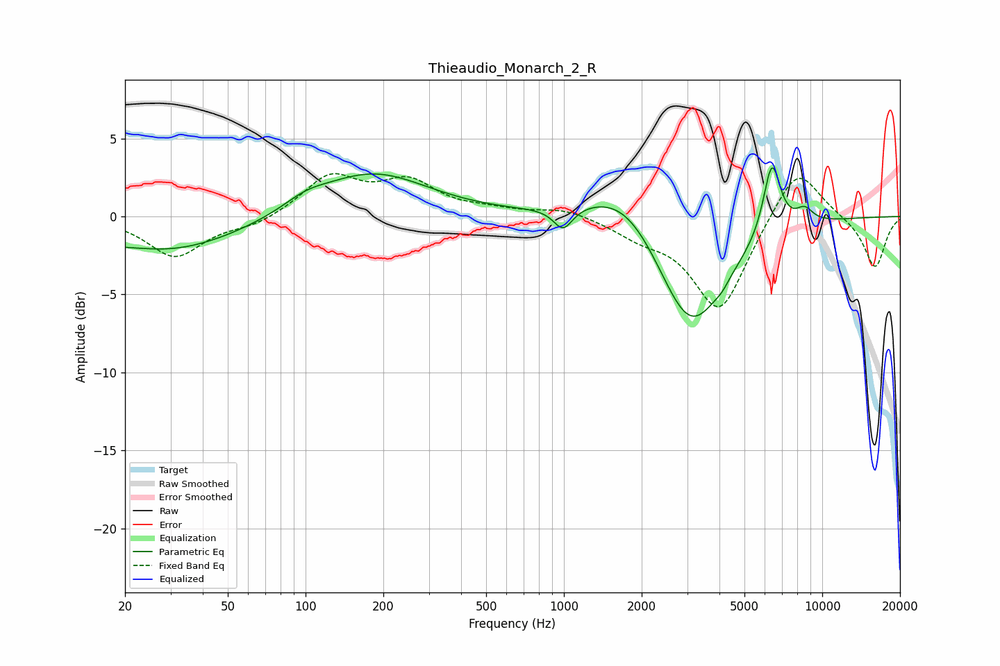

# Thieaudio_Monarch_2_R
See [usage instructions](https://github.com/jaakkopasanen/AutoEq#usage) for more options and info.

### Parametric EQs
Apply preamp of -3.2 dB when using parametric equalizer.

|   # | Type    |   Fc (Hz) |    Q |   Gain (dB) |
|-----|---------|-----------|------|-------------|
|   1 | Peaking |        22 | 1.32 |         0.3 |
|   2 | Peaking |        26 | 0.45 |        -2.5 |
|   3 | Peaking |       100 | 1.69 |         0.6 |
|   4 | Peaking |       180 | 0.65 |         2.8 |
|   5 | Peaking |       993 | 3.84 |        -1.4 |
|   6 | Peaking |      1754 | 0.89 |         3   |
|   7 | Peaking |      3082 | 1.01 |        -7.8 |
|   8 | Peaking |      4098 | 5.86 |        -0.3 |
|   9 | Peaking |      6383 | 4.02 |         4.8 |
|  10 | Peaking |      8537 | 3.76 |         0.9 |

### Fixed Band EQs
When using fixed band (also called graphic) equalizer, apply preamp of **-2.8 dB** (if available) and set gains manually with these parameters.

|   # | Type    |   Fc (Hz) |    Q |   Gain (dB) |
|-----|---------|-----------|------|-------------|
|   1 | Peaking |        31 | 1.41 |        -2.6 |
|   2 | Peaking |        62 | 1.41 |        -0.6 |
|   3 | Peaking |       125 | 1.41 |         2.5 |
|   4 | Peaking |       250 | 1.41 |         2.1 |
|   5 | Peaking |       500 | 1.41 |         0.3 |
|   6 | Peaking |      1000 | 1.41 |         0.5 |
|   7 | Peaking |      2000 | 1.41 |        -1   |
|   8 | Peaking |      4000 | 1.41 |        -6.1 |
|   9 | Peaking |      8000 | 1.41 |         3.5 |
|  10 | Peaking |     16000 | 1.41 |        -3.3 |

### Graphs

